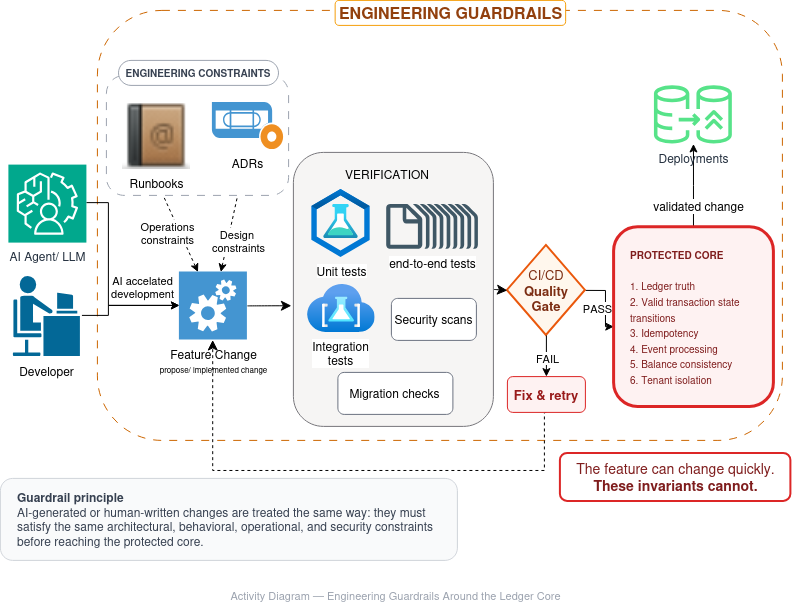

# Blockchain Transaction Simulator

A multi-tenant custodial ledger for an ERC20 token, built to answer one
question honestly: **how do you keep a database's view of "who owns what"
correct when the source of truth is an external, non-transactional
blockchain, and the workers reading it can crash, retry, and race each
other at any point?**

That's the hard problem this project is actually about. Everything else —
Fastify, Prisma, BullMQ, Prometheus — is the supporting cast for solving it
properly, not the point.

## The interesting decisions, if you only have five minutes

- **[ADR-004](docs/decisions/004-postgres-scheduler-lease.md)** — why
  scheduler coordination is PostgreSQL-backed rather than Redis-backed, and
  why that's deliberately *not* the layer correctness depends on.
- **[ADR-005](docs/decisions/005-idempotency-and-financial-correctness.md)**
  — the actual guarantee that a redelivered job, a crashed worker, or a
  racing confirmation never double-credits a transfer, and which of three
  overlapping layers (state machine, DB uniqueness, lease coordination)
  does the real work.
- **[Threat model](docs/security/threat-model.md)** — including the parts
  that are *not* fully hardened yet, named explicitly rather than glossed
  over.
- **[Roadmap](docs/ROADMAP.md)** — an honest, prioritized list of what
  separates this from a production-grade custody system, including two
  Prisma tables (`AuditLog`, `IdempotencyKey`) that are fully designed in
  the schema but not yet wired into the application — flagged rather than
  hidden.

## What it is

A backend platform modeling real blockchain transaction infrastructure:

* Multi-tenant transaction processing
* Blockchain transaction lifecycle management, enforced by an explicit
  finite-state machine (no implicit or ad-hoc status transitions)
* Event-driven blockchain indexing with cursor tracking and replay
* Background confirmation workers coordinated via a distributed scheduler
  lease
* KMS-backed custodial wallet key encryption
* Production-grade observability (structured logs, Prometheus metrics,
  correlation IDs)
* Containerized deployment with separate migration/release/rollback CI
  pipelines and pre-commit secret scanning

Built with **Node.js, TypeScript, Fastify, PostgreSQL, Prisma, and viem**,
applying enterprise engineering practices: separation of concerns,
idempotency at the persistence boundary, structured logging, metrics, and
test-driven development (72 test files across unit, integration, and
resilience suites).

## Known gaps (tracked, not hidden)

This is a portfolio-scale system, not a production custody product, and the
[roadmap](docs/ROADMAP.md) says so explicitly rather than implying
otherwise. Notably: API-key authentication (`src/auth/api-key.service.ts`)
is currently a stub despite a complete `ApiKey` schema, and there's no
fault-injection test yet that mechanically proves the crash-recovery
guarantees described in ADR-005 (they're architecturally sound, just not
yet chaos-tested). See the roadmap for the full, prioritized list.

---

# Architecture Overview

The system is designed around clear separation between API, domain logic, persistence, blockchain integration, background processing, and observability.

```
                         Client
                           |
                           v
                    Fastify REST API
                           |
          +----------------+----------------+
          |                                 |
          v                                 v
 Authentication                      Application Services
          |                                 |
          +----------------+----------------+
                           |
                           v
                     Ledger Layer
                           |
          +----------------+----------------+
          |                                 |
          v                                 v

     PostgreSQL                      Blockchain RPC
     Prisma ORM                      viem Client

                                           |
                                           v

                                  Worker Services

                                           |
                    +----------------------+----------------+
                    |                                       |
                    v                                       v

          Confirmation Worker                    Event Listener

                    |
                    v

          Balance Synchronization
```
Take a look at the detail architecture [here](./docs/architecture.md)

---

### Engineering Guardrails & Invariants
To maintain ledger integrity, all system modifications—whether authored by developers or generated by AI tools—must pass through identical verification gates before touching the immutable core application rules.



#### The Protected Core Invariants
While application features, APIs, and tooling can evolve rapidly, the core transaction engine strictly enforces these six static invariants that cannot change:
1. **Ledger truth** — Persistent deterministic ledger accounting.
2. **Valid transaction state transitions** — FSM-enforced lifecycle paths.
3. **Idempotency** — Multi-layered double-credit prevention boundaries.
4. **Event processing** — Tracked cursor replay indexing.
5. **Balance consistency** — Synchronized point-in-time snapshots.
6. **Tenant isolation** — Multi-tenant database boundary verification.

#### The Verification Pipeline
Every feature change undergoes automated operations and architectural design constraints evaluation:
* **Unit & Integration Tests** — Continuous safety validation (72 test suites).
* **Security Scans & Migration Checks** — Secret detection and database schema safety gates.
* **CI/CD Quality Gate** — Hard pass/fail condition blocking unsafe deploy

# Technology Stack

## Backend

* Node.js
* TypeScript
* Fastify 5
* Prisma ORM
* PostgreSQL
* Zod validation
* Vitest testing framework

## Blockchain

* viem
* Ethereum-compatible RPC
* Hardhat 3
* Anvil local blockchain
* Solidity smart contracts

## Observability

* Pino structured logging
* Prometheus metrics
* AsyncLocalStorage context propagation
* Request correlation IDs
* RPC instrumentation
* Worker lifecycle metrics

## Deployment

* Docker
* Docker Compose
* Production-style container lifecycle
* Prometheus monitoring

---

# Core Features

## Transaction Lifecycle Management

The simulator implements a complete blockchain transaction lifecycle:

```
Transaction Created
        |
        v
PENDING
        |
        v
Blockchain Submission
        |
        v
Transaction Hash Stored
        |
        v
Confirmation Worker Polling
        |
        +----------------+
        |                |
        v                v
   CONFIRMED          FAILED
        |
        v
Event Processing
        |
        v
Balance Synchronization
```

Implemented capabilities:

* Transaction creation
* Blockchain submission
* Transaction hash persistence
* Receipt confirmation
* Confirmation status tracking
* Gas usage recording
* Block number persistence
* Failure handling
* Transaction lifecycle metrics

---

# Blockchain Event Processing

The platform uses event-driven indexing instead of relying only on database state.

Features:

* ERC20 Transfer event processing
* Event cursor tracking
* Duplicate event protection
* Token transfer persistence
* Balance snapshot synchronization

Benefits:

* Replay capability
* Auditability
* Eventual consistency model
* Reliable blockchain synchronization

---

# Multi-Tenant Design

The application supports tenant isolation across the platform.

Implemented entities:

* Tenant
* Users
* Wallets
* Tokens
* Transactions
* Token Transfers
* Balance Snapshots
* API Keys

The architecture is designed so multiple organizations can operate independently within the same application.

---

# API Capabilities

Implemented APIs include:

## Authentication

* User authentication
* JWT based access
* Refresh token support
* API key management *(schema and tenant lookup exist; dedicated
  `ApiKeyService` — hashing, scopes, expiry/revocation enforcement — is
  in progress, see [roadmap](docs/ROADMAP.md#phase-0--finish-whats-already-designed-do-this-first-its-cheap))*

## Tenant Management

* Tenant creation
* Tenant isolation

## Wallet Management

* Wallet registration
* Wallet ownership tracking

## Token Management

* Token registration
* ERC20 token interaction

## Transactions

* Create blockchain transactions
* Track transaction lifecycle
* Query transaction status

---

# Observability

The project includes production-style observability.

The observability architecture uses:

* AsyncLocalStorage context propagation
* Context-aware structured logging
* Correlation IDs
* Metrics instrumentation
* Worker lifecycle tracking
* RPC resilience monitoring

---

## Structured Logging

Implemented with Pino.

Example:

```json
{
  "service": "blockchain-transaction-simulator",
  "operation": "transaction.confirmed",
  "transactionId": "tx-123",
  "txHash": "0xabc",
  "blockNumber": 100,
  "status": "CONFIRMED"
}
```

---

## Prometheus Metrics

API metrics endpoint:

```
GET /api/v1/metrics
```

Worker metrics endpoint:

```
GET /metrics
```

Implemented metrics include:

### Transaction Metrics

```
transactions_created_total
transactions_confirmed_total
transactions_failed_total
transaction_confirmation_duration_seconds
```

### Blockchain RPC Metrics

```
blockchain_rpc_requests_total
blockchain_rpc_failures_total
blockchain_rpc_duration_seconds
blockchain_rpc_retries_total
```

### Worker Metrics

```
worker_cycles_total
worker_failures_total
worker_duration_seconds
worker_ready
pending_transactions
event_listener_cycles_total
```

---

# RPC Resilience

Blockchain communication includes production-style resilience features:

Implemented:

* RPC timeout handling
* Retry policies
* Exponential backoff
* Error classification
* Failure metrics
* Structured retry logging

RPC execution is centralized through:

```
src/blockchain/rpc.executor.ts
```

---

# Testing

The project maintains comprehensive automated coverage.

Current status:

```
Test Files: 37 passed
Tests: 134 passed
```

Quality gates:

```bash
npm test

npm run lint

npm run typecheck
```

Testing includes:

## Unit Tests

* Services
* Repositories
* Validators
* Authentication logic
* Business workflows

## Integration Tests

* Blockchain transaction lifecycle
* Smart contract interaction
* Event indexing
* Confirmation processing

## Observability Tests

* Metric registration
* RPC instrumentation
* Worker instrumentation

# Load Testing

## Prerequisites

- Stack running locally: `docker compose up`
- [k6](https://k6.io/) installed
- Seeded fixtures (tenant, user, token, two custodial wallets). Do **not**
  point this at a shared/staging environment without confirming with
  whoever owns it — this test creates real transactions.

## Seeding fixtures

```bash
npm run load-test:seed
```

This reuses `test/factories/*` — the same factories the integration suite
uses — rather than separate hand-rolled seed logic, so load-test fixtures
never drift out of sync with what the correctness tests already validate.
It prints `export ...` lines; paste them into your shell, or capture as
JSON:

```bash
npx tsx load-test/seed.ts --json > load-test/.env.load-test.json
```

Each run creates a fresh tenant/user/wallets — this is intentionally not
idempotent, so re-run it per load-test session rather than reusing stale
IDs across days.

## Running

```bash
export LOAD_TEST_EMAIL=load-test@example.com
export LOAD_TEST_PASSWORD=...
export LOAD_TEST_TOKEN_ID=...
export LOAD_TEST_FROM_WALLET_ID=...
export LOAD_TEST_TO_WALLET_ID=...

k6 run load-test/transfer-flow.js
k6 run --vus 50 --duration 2m load-test/transfer-flow.js
```

## What to do with the results

This script is instrumentation, not a benchmark result. Running it once and
eyeballing the output is not the deliverable — the deliverable is
`docs/capacity-planning.md` (roadmap Phase 3), which should record:

1. Baseline: throughput and p95/p99 latency at low concurrency (confirms
   the harness itself isn't the bottleneck).
2. Where it breaks first as VUs increase — API CPU, Postgres connection
   pool exhaustion, BullMQ/Redis queue depth, or RPC provider rate limiting.
   Watch `docs/observability.md`'s Prometheus dashboards while the test
   runs; the bottleneck should be visible there, not just inferred from k6
   output.
3. The specific, named change that raises each ceiling (e.g. "Postgres pool
   size is the limit at ~40 concurrent transfers; raising `connection_limit`
   in `DATABASE_URL` moves the ceiling to Redis/BullMQ throughput next").

A load-test script without a written-down bottleneck analysis is a much
weaker signal than one with three sentences saying exactly where the system
breaks and why.

---

# Development Setup

## Requirements

* Node.js 23+
* PostgreSQL
* Docker
* Anvil / Hardhat

---

## Install Dependencies

```bash
npm install
```

---

## Environment Setup

Create:

```
.env
```

Configure:

```
DATABASE_URL=

RPC_URL=

DEPLOYER_PRIVATE_KEY=

JWT_SECRET=
```

---

## Database Migration

Development:

```bash
npx prisma migrate dev
```

Production:

```bash
npx prisma migrate deploy
```

---

## Start Blockchain

Start Anvil:

```bash
anvil
```

---

## Start Application

Development:

```bash
npm run api:dev
```

Worker:

```bash
npm run worker:event-listener
```

---

# Docker Deployment

The project uses a single immutable Docker image.

The same image runs:

* API container
* Worker container
* Migration job

Example:

```
blockchain-transaction-simulator:<version>

        |
        +-- API
        |
        +-- Worker
        |
        +-- Migration
```

---

## Local Container Deployment

Start:

```bash
docker compose up --build
```

Provides:

* PostgreSQL
* API service
* Worker service
* Prometheus

---

## Production Deployment

Production deployment uses:

```bash
docker compose \
  --env-file .env.production \
  -f docker-compose.prod.yml \
  up -d --build
```

Deployment lifecycle:

```
PostgreSQL

      |
      v

Migration Job

      |
      v

API Container

      |
      v

Worker Container

      |
      v

Health Checks
```

---

# Health Checks

API health endpoint:

```
GET /api/v1/health
```

API metrics:

```
GET /api/v1/metrics
```

Worker metrics:

```
GET /metrics
```

Container health checks verify:

* Service availability
* Database connectivity
* Runtime readiness

---

# Project Structure

```
src
├── api
│   ├── routes
│   └── middleware
│
├── auth
│
├── blockchain
│   ├── rpc.executor.ts
│   ├── rpc.instrumentation.ts
│   ├── rpc.errors.ts
│   └── rpc.classifier.ts
│
├── observability
│   ├── logger.ts
│   ├── metrics.ts
│   ├── bootstrap.ts
│   ├── context.ts
│   ├── tracing.ts
│   ├── rpc.metrics.ts
│   ├── transaction.metrics.ts
│   └── worker.metrics.ts
│
├── repositories
│
├── services
│
├── workers
│
└── contracts
```

---

# Engineering Principles

The project follows production backend engineering practices:

* Domain-driven service separation
* Repository abstraction
* Ledger abstraction
* Idempotent event processing
* Explicit transaction lifecycle states
* Structured operational logging
* Metrics-first observability
* RPC resilience patterns
* Automated regression testing
* Clean dependency boundaries

---

# Production Readiness Status

Completed:

✅ Transaction lifecycle
✅ Blockchain integration
✅ Event-driven indexing
✅ Worker hardening
✅ RPC resilience
✅ Production observability
✅ Docker deployment
✅ Health checks
✅ Prometheus monitoring
✅ Automated quality gates

---

# Future Roadmap

Planned improvements:

* Kubernetes manifests
* Helm charts
* Cloud deployment automation
* Horizontal worker scaling
* Managed Prometheus integration
* Full OpenTelemetry tracing
* Blue/green deployments
* Blockchain explorer dashboard

---

# License

MIT License