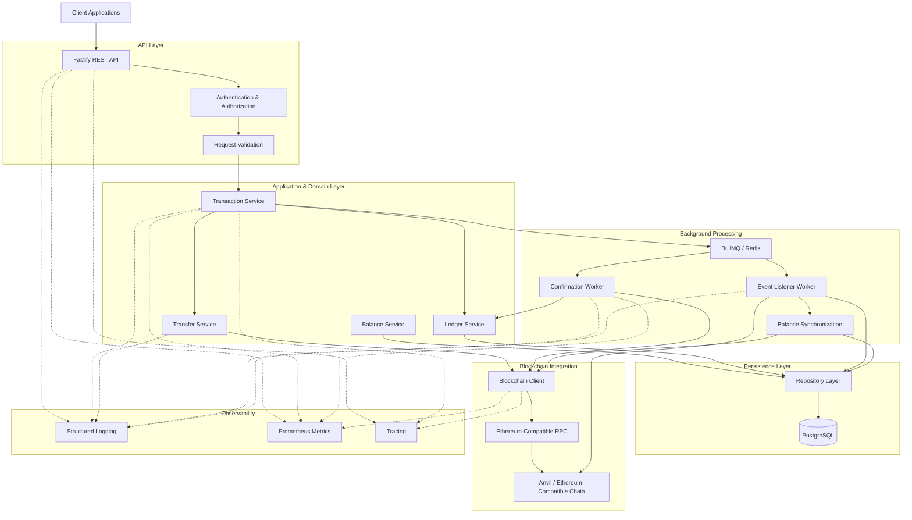
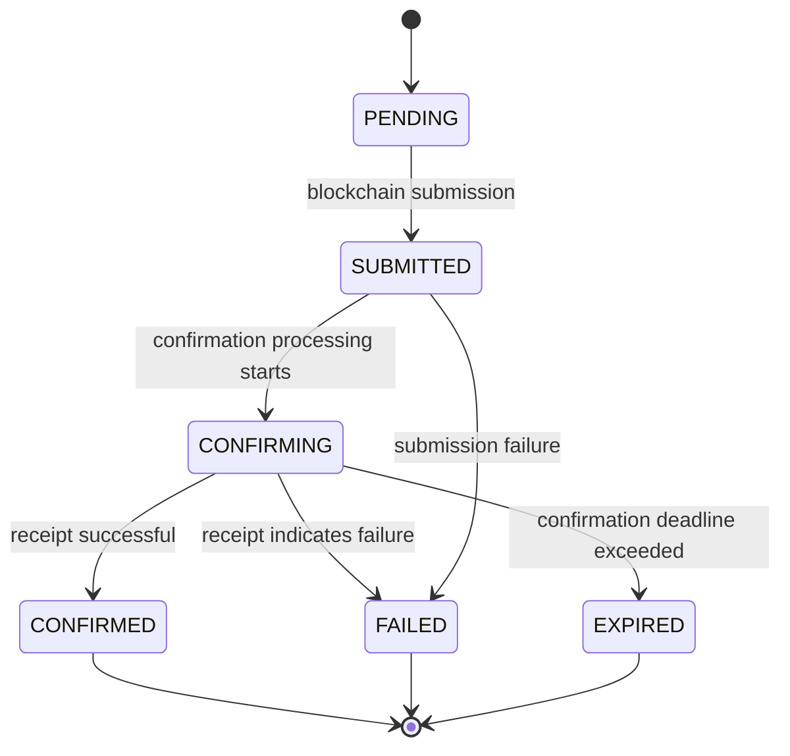
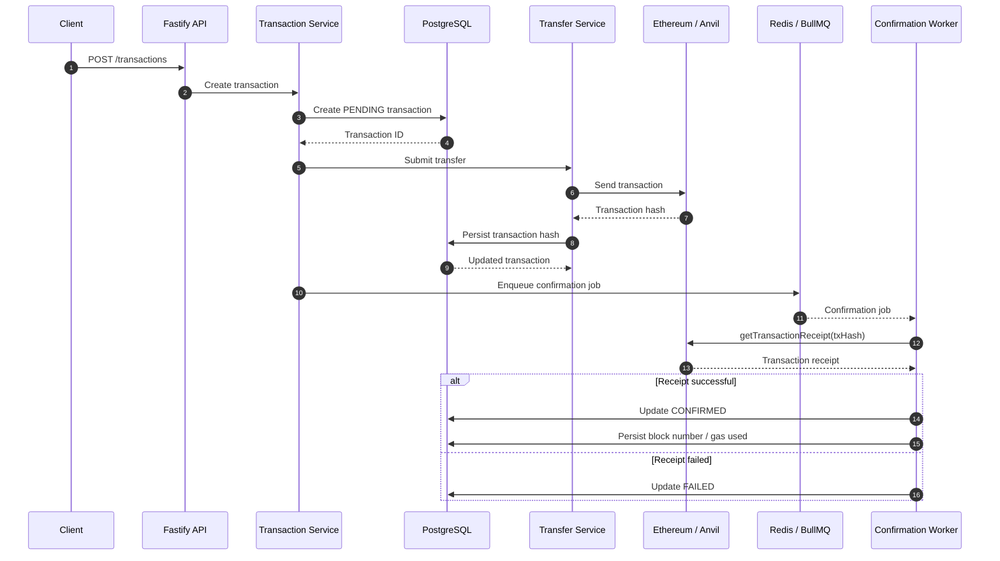
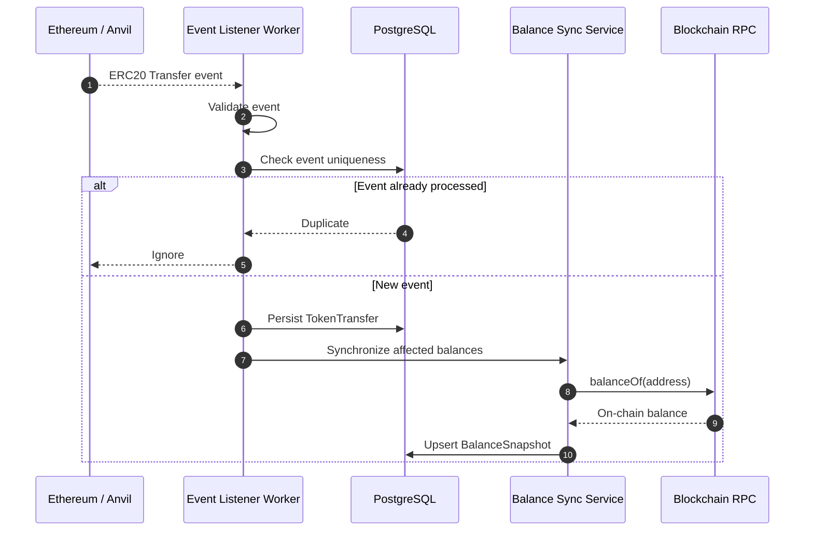
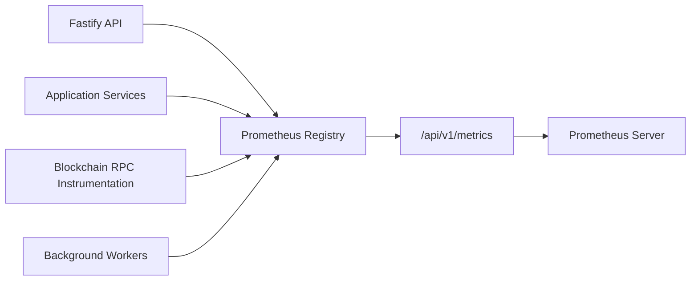
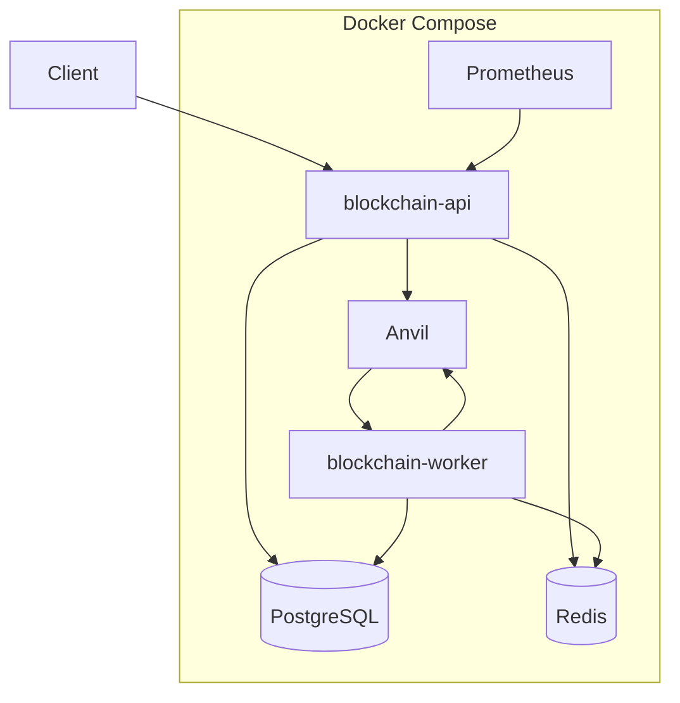

# System Architecture

## Overview

The Blockchain Transaction Simulator is designed as a production-oriented backend platform that models how enterprise systems interact with blockchain networks.

The architecture separates responsibilities across:

* API layer
* Authentication and authorization
* Domain services
* Ledger abstraction
* Persistence layer
* Blockchain integration
* Background workers
* Observability infrastructure

The primary design goal is to keep blockchain-specific concerns isolated while maintaining reliable transaction processing, auditability, idempotency, and operational visibility.

---

# High-Level Architecture



The architecture is divided into six major areas:

1. **API Layer** — external HTTP interface and security boundaries.
2. **Application & Domain Layer** — business workflows and transaction orchestration.
3. **Persistence Layer** — PostgreSQL access through repositories and Prisma.
4. **Blockchain Integration** — RPC, wallet signing, contract interaction, and receipt retrieval.
5. **Background Processing** — asynchronous confirmation and blockchain event processing.
6. **Observability** — logs, metrics, correlation context, and tracing foundations.

---

# Architectural Layers

## API Layer

Location:

```text
src/api
```

Responsibilities:

* HTTP routing
* Request handling
* Authentication middleware
* Input validation
* Response formatting
* Error handling

The API layer does not contain business logic.

Example flow:

```text
HTTP Request
      |
      v
Route Handler
      |
      v
Service Layer
      |
      v
Repository Layer
```

This keeps API concerns separated from domain behavior.

---

# Authentication Layer

Location:

```text
src/auth
```

Responsibilities:

* User authentication
* Password management
* JWT generation
* Refresh token lifecycle
* API key validation

Security boundaries are enforced before requests reach business services.

---

# Service Layer

Location:

```text
src/services
```

The service layer contains business workflows.

Major services include:

## Transaction Service

Responsible for:

* Creating transactions
* Validating transaction requests
* Managing transaction state
* Coordinating transaction submission

---

## Transfer Service

Responsible for:

* Preparing blockchain transfers
* Interacting with wallet clients
* Submitting blockchain transactions
* Returning blockchain transaction hashes

---

## Ledger Service

Responsible for:

* Maintaining transaction records
* Persisting blockchain lifecycle information
* Attaching blockchain transaction hashes
* Recording confirmation information

The ledger abstraction prevents blockchain details from leaking into the rest of the application.

---

## Balance Service

Responsible for:

* Managing balance information
* Providing balance queries
* Coordinating balance synchronization

---

# Repository Layer

Location:

```text
src/repositories
```

Responsibilities:

* Database access
* Query abstraction
* Persistence operations
* Transactional database operations

Repositories isolate Prisma/database concerns from business logic.

Examples:

```text
TransactionRepository

TokenRepository

WalletRepository

TransferRepository

BalanceSnapshotRepository
```

---

# Database Architecture

The system uses:

* PostgreSQL
* Prisma ORM

Core entities include:

```text
Tenant
 |
 +-- User
 |
 +-- Wallet
 |
 +-- Token
 |
 +-- Transaction
 |
 +-- TokenTransfer
 |
 +-- BalanceSnapshot
```

The database stores both application state and projections derived from blockchain activity.

Blockchain-derived information is persisted so that application queries do not require direct RPC calls for every request.

---

# Blockchain Integration Layer

Location:

```text
src/blockchain
```

The blockchain layer encapsulates:

* RPC communication
* Wallet signing
* Smart contract interaction
* Transaction submission
* Transaction receipt retrieval
* ERC20 interaction
* RPC observability

Technology:

* viem
* Ethereum-compatible RPC
* Anvil for local development and E2E testing

The application should interact with blockchain infrastructure through this layer rather than directly coupling domain services to RPC implementations.

---

# Transaction Processing Flow

A transaction follows this general lifecycle:

```text
Client Request
      |
      v
Transaction Service
      |
      v
Create Database Transaction
(PENDING)
      |
      v
Blockchain Submission
      |
      v
Persist Transaction Hash
      |
      v
Confirmation Worker
      |
      +----------------+
      |                |
      v                v
 CONFIRMED          FAILED
      |
      v
Event Processing
      |
      v
Balance Synchronization
```

The actual lifecycle is represented by the following state machine.

# Transaction Lifecycle



The normal transaction path is:

```text
PENDING
   |
   v
SUBMITTED
   |
   v
CONFIRMING
   |
   v
CONFIRMED
```

Failure and timeout paths terminate in `FAILED` or `EXPIRED`.

---

# Blockchain Transaction Sequence

The following sequence illustrates how a transaction moves from an API request to blockchain confirmation.



This asynchronous model prevents API requests from blocking while waiting for blockchain confirmation.

---

# Background Workers

Location:

```text
src/workers
```

Workers provide asynchronous processing and isolate long-running blockchain operations from the HTTP request lifecycle.

---

## Confirmation Worker

Responsibilities:

* Poll pending blockchain transactions
* Retrieve transaction receipts
* Update transaction status
* Record block number
* Record gas usage
* Enforce confirmation deadlines
* Handle retries

Flow:

```text
Pending Transaction
        |
        v
getTransactionReceipt()
        |
        +----------------+
        |                |
        v                v
    Success            Failure
        |                |
        v                v
   CONFIRMED           FAILED
```

The confirmation worker is designed to tolerate retries and worker restarts.

---

## Event Listener Worker

Responsibilities:

* Read blockchain events
* Process ERC20 `Transfer` events
* Persist token transfers
* Prevent duplicate processing
* Trigger balance synchronization

The listener follows an event-driven synchronization model.

---

# Event-Driven Design

Blockchain state is treated as an external source of truth for blockchain-derived data.

Instead of relying only on database state:

```text
Blockchain Event
        |
        v
Event Listener
        |
        v
Database Projection
        |
        v
Application Queries
```

This provides:

* Replay capability
* Auditability
* Idempotent processing
* Recovery after failures
* Separation between blockchain state and application projections

---

# Blockchain Event Processing



The event listener treats blockchain events as an input stream and PostgreSQL as the durable application projection.

---

# Idempotency Design

Blockchain processing must tolerate:

* Worker retries
* Duplicate event delivery
* Worker restarts
* Network failures
* Transaction polling retries
* Event replay

## Transaction Idempotency

The internal transaction ID provides application-level identity, while the blockchain transaction hash identifies the submitted on-chain transaction.

The system should not create a second logical transaction simply because a blockchain submission or confirmation operation is retried.

---

## Event Idempotency

ERC20 transfer events are uniquely identified using blockchain-specific event coordinates such as:

* Transaction hash
* Log index

This prevents duplicate `TokenTransfer` records when an event is replayed or processed more than once.

---

## Worker Idempotency

Confirmation jobs may execute more than once because of retries or worker restarts.

Confirmation processing therefore treats already-terminal transaction states as idempotent and avoids creating duplicate lifecycle transitions.

---

# Balance Synchronization

Balance information is derived from the blockchain rather than being treated as an independently authoritative value.

The synchronization flow is:

```text
Blockchain Transfer Event
        |
        v
Event Listener
        |
        v
Affected Wallet
        |
        v
Balance Sync Service
        |
        v
ERC20 balanceOf()
        |
        v
BalanceSnapshot
```

This provides a recoverable projection of blockchain balances inside the application database.

---

# Queue Architecture

Redis and BullMQ provide asynchronous job execution between transaction processing and background workers.

```text
Application
     |
     v
BullMQ Queue
     |
     v
Redis
     |
     +----------------------+
     |                      |
     v                      v
Confirmation Worker    Event Processing
```

The queue provides:

* Asynchronous processing
* Retry support
* Exponential backoff
* Worker concurrency
* Failure isolation

The confirmation workflow is intentionally decoupled from the synchronous API request.

---

# Observability Architecture

Location:

```text
src/observability
```

Observability is built into the application lifecycle.

Components:

```text
Logger
 |
 +-- Structured JSON logs
 +-- Correlation IDs
 +-- Transaction context
 +-- Worker lifecycle logging


Metrics
 |
 +-- Prometheus registry
 +-- Transaction metrics
 +-- RPC metrics
 +-- Worker metrics


Tracing
 |
 +-- Distributed tracing foundation
 +-- Request context
 +-- Transaction context
```

---

# Metrics Flow



Metrics provide operational visibility into:

* Transaction submission
* Transaction confirmation
* RPC calls
* Worker processing
* Processing latency
* Failure rates

---

# Logging Flow

```text
HTTP Request
     |
     v
Correlation Context
     |
     +--------------------+
     |                    |
     v                    v
Application Logs      Transaction Logs
     |                    |
     +---------+----------+
               |
               v
       Structured Pino Logs
```

Structured logs make it possible to correlate:

* HTTP requests
* Transaction IDs
* Blockchain transaction hashes
* Worker jobs
* RPC operations

---

# Error Handling Architecture

The system uses centralized error handling.

Flow:

```text
Service Error
      |
      v
Application Error
      |
      v
Fastify Error Handler
      |
      v
Structured Error Log
      |
      v
Standard API Response
```

Benefits:

* Consistent client responses
* Better debugging
* Centralized logging
* Clear separation between internal errors and API responses

---

# Deployment Architecture

The local production-oriented environment is composed of independent containers.



The containerized architecture provides isolation between:

* HTTP request processing
* Background transaction processing
* Persistence
* Queue infrastructure
* Blockchain infrastructure
* Monitoring

In production, Anvil can be replaced by an external Ethereum-compatible network without changing the higher-level application architecture.

---

# Security Boundaries

The main security boundary is established at the API layer.

```text
External Client
      |
      v
Authentication
      |
      v
Authorization
      |
      v
Input Validation
      |
      v
Application Services
      |
      v
Internal Infrastructure
```

Blockchain signing credentials and infrastructure configuration remain outside the persistence model.

The application should not store private keys in PostgreSQL.

---

# Data Ownership

The architecture distinguishes between application-owned state and blockchain-derived state.

| Data                  | Primary Source                     |
| --------------------- | ---------------------------------- |
| Users                 | PostgreSQL                         |
| Tenants               | PostgreSQL                         |
| Wallet metadata       | PostgreSQL                         |
| Transaction lifecycle | PostgreSQL                         |
| Transaction hash      | Blockchain + PostgreSQL            |
| Token metadata        | PostgreSQL / configured blockchain |
| Token transfers       | Blockchain events                  |
| Blockchain balances   | Blockchain                         |
| Balance snapshots     | PostgreSQL projection              |
| Confirmation receipt  | Blockchain                         |
| Gas usage             | Blockchain receipt                 |

This distinction is important because PostgreSQL is an application persistence layer, while the blockchain remains authoritative for on-chain state.

---

# Design Principles

## Separation of Concerns

Each layer has a clear responsibility.

---

## Dependency Isolation

Business logic does not directly depend on:

* HTTP
* Prisma
* PostgreSQL
* Blockchain RPC implementations

External infrastructure is accessed through abstractions and dedicated adapters.

---

## Ledger Abstraction

Blockchain-specific transaction mechanics are isolated behind the ledger/blockchain integration boundary.

This allows the application domain to reason about transactions without being tightly coupled to a particular blockchain client implementation.

---

## Event-Driven Synchronization

Blockchain events are used to build application projections.

This provides a foundation for:

* Replay
* Recovery
* Auditability
* Event deduplication
* Eventual consistency

---

## Idempotent Processing

Every asynchronous workflow must be safe to retry.

This applies to:

* Transaction submission
* Confirmation jobs
* Blockchain event processing
* Balance synchronization

---

## Testability

Components are designed for isolated testing through:

* Dependency injection
* Mocked external systems
* Repository abstraction
* Dedicated integration tests
* Docker-based E2E testing

---

## Observability by Default

Important lifecycle operations emit:

* Structured logs
* Metrics
* Correlation context
* Transaction context

Observability is treated as part of the application architecture rather than an operational afterthought.

---

## Production Readiness

The architecture includes:

* Structured logging
* Metrics
* Background processing
* Failure handling
* Idempotency
* Transaction lifecycle tracking
* Confirmation timeouts
* Automated testing
* Docker-based deployment
* Blockchain RPC instrumentation

---

# Architectural Trade-offs

## PostgreSQL as the Application Projection

The blockchain is authoritative for on-chain state, while PostgreSQL provides efficient application queries.

This introduces eventual consistency between blockchain state and database projections.

The trade-off is intentional because querying the blockchain directly for every application request would increase latency and infrastructure dependency.

---

## Asynchronous Confirmation

Transactions are not synchronously confirmed during the API request.

Instead:

```text
API
 |
 v
Submit Transaction
 |
 v
Return / Persist Transaction
 |
 v
Background Confirmation
```

This prevents blockchain confirmation latency from blocking HTTP requests.

---

## Eventual Consistency

After a blockchain transaction is confirmed, event processing and balance synchronization may occur asynchronously.

Therefore:

```text
Blockchain State
       |
       v
Event Processing
       |
       v
Database Projection
```

may temporarily lag behind the blockchain.

The architecture favors reliability and recoverability over strict synchronous consistency.

---

# Failure and Recovery Model

The architecture assumes that external infrastructure can fail.

Potential failures include:

* RPC unavailable
* Blockchain transaction submission failure
* Transaction confirmation timeout
* Redis unavailable
* Worker restart
* PostgreSQL connection failure
* Duplicate blockchain events
* Network interruption

Recovery mechanisms include:

```text
Failure
  |
  +--> Retry
  |
  +--> Queue Backoff
  |
  +--> Idempotent Processing
  |
  +--> Event Replay
  |
  +--> Database Projection Reconciliation
  |
  +--> Operational Observability
```

This allows the system to recover without requiring manual database manipulation for normal transient failures.

---

# Future Architecture Evolution

The current architecture provides a foundation for horizontal and distributed scaling.

```text
Current System
      |
      v
Horizontal API Scaling
      |
      v
Distributed Workers
      |
      v
External Blockchain RPC
      |
      +----------------------+
      |                      |
      v                      v
Kubernetes              Cloud Monitoring
      |
      v
OpenTelemetry
```

Future improvements may include:

* OpenTelemetry tracing
* Distributed worker execution
* Multiple blockchain networks
* External message queues
* Kubernetes deployment
* Horizontal API scaling
* Horizontal worker scaling
* Cloud-native monitoring
* Blockchain indexer abstraction
* Multi-chain transaction routing
* Dead-letter queues
* Automated reconciliation jobs

---

# Architectural Goals

The architecture is designed around the following goals:

```text
                    +----------------------+
                    |   Reliable          |
                    | Transaction         |
                    | Processing          |
                    +----------+-----------+
                               |
             +-----------------+-----------------+
             |                 |                 |
             v                 v                 v
       Blockchain         Persistence      Observability
        Isolation          & Auditability      & Metrics
             |                 |                 |
             +-----------------+-----------------+
                               |
                               v
                     Production-Ready
                       Architecture
```

The resulting system provides a clear separation between:

* Client-facing APIs
* Business workflows
* Persistent application state
* Blockchain infrastructure
* Asynchronous processing
* Event-driven projections
* Operational observability

This separation allows the simulator to model production blockchain transaction infrastructure while remaining testable, recoverable, and extensible.
