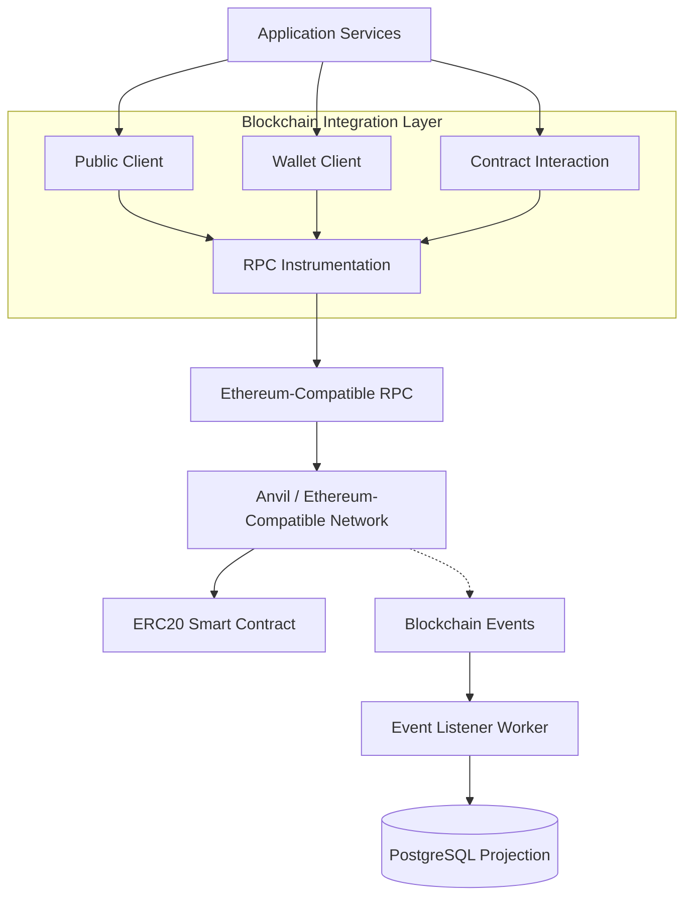
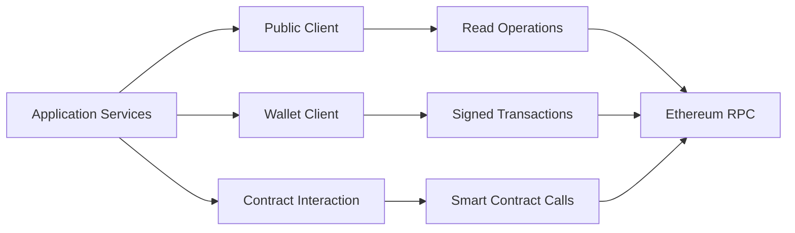
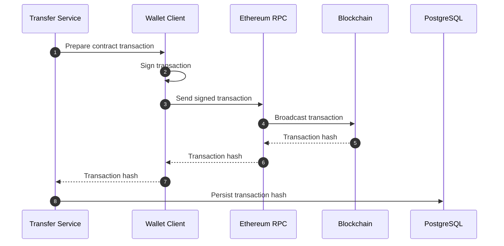
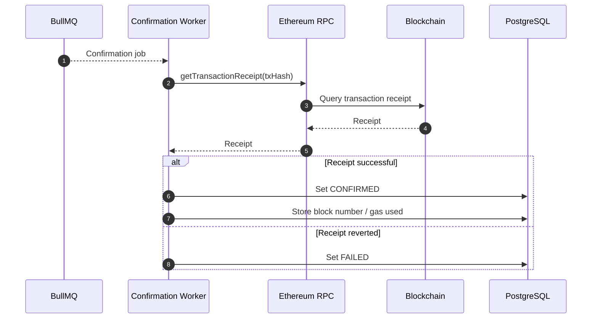
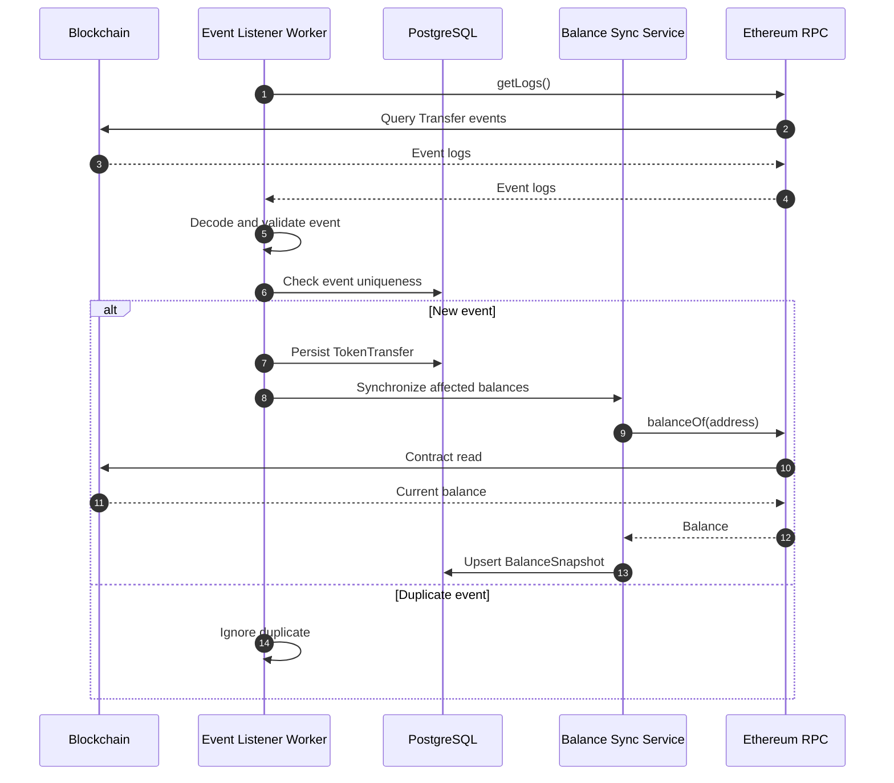
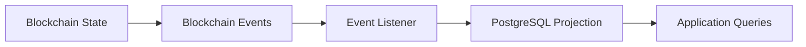
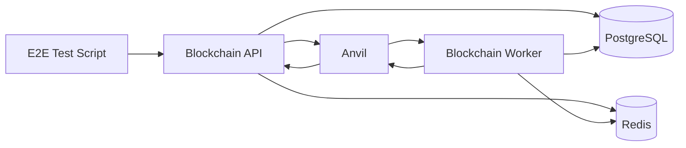

# Blockchain Integration Architecture

## Overview

The Blockchain Transaction Simulator integrates with Ethereum-compatible blockchain networks to execute transactions, monitor confirmations, process blockchain events, and synchronize blockchain-derived state into PostgreSQL.

The blockchain integration layer isolates blockchain-specific concerns from application business logic.

The design separates:

* Blockchain client creation
* Wallet signing
* Smart contract interaction
* RPC communication
* Transaction submission
* Transaction confirmation
* Event indexing
* Balance synchronization
* RPC observability

The blockchain remains the authoritative source for on-chain state, while PostgreSQL maintains application state and durable projections of blockchain activity.

---

# Blockchain Architecture



The blockchain integration layer provides the boundary between application services and the external blockchain network.

---

# Technology Stack

| Component         | Technology            |
| ----------------- | --------------------- |
| Blockchain Client | viem                  |
| Local Blockchain  | Anvil                 |
| Contract Tooling  | Hardhat               |
| Smart Contracts   | Solidity              |
| Network Interface | Ethereum JSON-RPC     |
| ERC20 Token       | MiniUSDT              |
| Chain ID          | 31337 for local Anvil |

---

# Blockchain Responsibilities

The blockchain layer is responsible for:

* Creating blockchain clients
* Reading blockchain state
* Signing transactions
* Sending transactions
* Calling smart contracts
* Retrieving transaction receipts
* Reading blockchain logs
* Decoding blockchain events
* Providing RPC instrumentation

It does not contain:

* HTTP routing
* Authentication
* Authorization
* API response formatting
* Database business workflows
* User management
* Application-level transaction orchestration

---

# Client Architecture

The application uses different viem client capabilities depending on the operation.



---

# Public Client

The Public Client is used for blockchain read operations.

Examples include:

* Transaction receipt retrieval
* Contract state queries
* ERC20 balance queries
* Event log retrieval
* Blockchain reads

Typical operations include:

```text
getTransactionReceipt()

readContract()

getLogs()

getBlockNumber()
```

The Public Client does not sign transactions.

---

# Wallet Client

The Wallet Client is used for blockchain write operations.

Responsibilities include:

* Signing transactions
* Sending transactions
* Executing contract write methods
* Managing the account used for blockchain transactions

Example flow:

```text
Application
    |
    v
Transfer Service
    |
    v
Wallet Client
    |
    v
Signed Transaction
    |
    v
Ethereum RPC
    |
    v
Blockchain
```

Private keys are provided through runtime configuration and are not persisted as application data.

---

# Smart Contract Integration

The project currently interacts with an ERC20-compatible token contract, `MiniUSDT`.

The contract uses 6 decimal places and provides token operations used by the simulator.

The application interacts with the contract through the blockchain integration layer.

---

# Token Minting

The token mint operation follows this pattern:

```text
Mint Request
     |
     v
Mint Service
     |
     v
Contract Write
     |
     v
Wallet Client
     |
     v
Ethereum RPC
     |
     v
MiniUSDT Contract
     |
     v
ERC20 Transfer Event
```

The resulting blockchain transaction can subsequently be observed by the event listener.

---

# Token Transfer

The transfer flow is:

```text
Transfer Request
       |
       v
Transaction Service
       |
       v
Transfer Service
       |
       v
Wallet Client
       |
       v
MiniUSDT Contract
       |
       v
Blockchain Transaction
       |
       v
ERC20 Transfer Event
```

The transaction hash returned by the blockchain is persisted against the application's transaction record.

---

# Transaction Submission Flow

The blockchain submission lifecycle is:



A successful submission only means that the blockchain accepted the transaction for processing.

It does **not** mean that the transaction has been confirmed.

---

# Transaction Hash Persistence

The application maintains a relationship between the internal transaction and the blockchain transaction.

```text
Application Transaction
        |
        +-- Internal Transaction ID
        |
        +-- Status
        |
        +-- Confirmation Metadata
        |
        +-- Blockchain Transaction Hash
                         |
                         v
                  Blockchain Transaction
```

The internal transaction ID identifies the application's transaction.

The blockchain transaction hash identifies the corresponding on-chain transaction.

---

# Transaction Confirmation

Blockchain transactions are asynchronous.

After submission, the Confirmation Worker is responsible for monitoring the transaction.



The Confirmation Worker therefore separates transaction submission from transaction confirmation.

---

# Transaction Confirmation Lifecycle

The blockchain-facing lifecycle is:

```text
PENDING
   |
   v
SUBMITTED
   |
   v
CONFIRMING
   |
   +------------------+
   |                  |
   v                  v
CONFIRMED           FAILED
   |
   v
Blockchain Event
```

A transaction can also terminate as `EXPIRED` when the configured confirmation deadline is exceeded.

The complete lifecycle is documented in:

```text
docs/transaction-lifecycle.md
```

---

# Nonce Management

Blockchain transactions from the same account require correct nonce sequencing.

The application therefore treats nonce management as part of the transaction submission boundary.

```text
Transaction Request
       |
       v
Wallet / Account
       |
       v
Nonce Management
       |
       v
Signed Transaction
       |
       v
Blockchain RPC
```

Nonce-related failures can occur when:

* A nonce is reused
* A transaction is submitted with an outdated nonce
* Multiple transactions are submitted concurrently
* Local application state diverges from blockchain account state

Nonce management must therefore remain coordinated with the blockchain account's current nonce.

This is particularly important for concurrent transaction submission and E2E testing.

---

# RPC Communication

All blockchain communication occurs through Ethereum-compatible JSON-RPC.

Representative operations include:

```text
eth_sendRawTransaction

eth_getTransactionReceipt

eth_getLogs

eth_call

eth_getTransactionCount
```

The application treats RPC as an external dependency and therefore expects:

* Latency
* Temporary failures
* Network interruptions
* Provider errors
* Rate limits

---

# RPC Instrumentation

RPC calls are instrumented through:

```text
src/blockchain/rpc.instrumentation.ts
```

The purpose is to make blockchain communication observable.

The instrumentation captures information such as:

* RPC latency
* RPC failures
* Operation type
* Error context

Flow:

```text
RPC Request
     |
     v
RPC Instrumentation
     |
     +----------------------+
     |                      |
     v                      v
Execute RPC Call       Record Metrics
     |
     v
Return Result
```

This allows blockchain infrastructure problems to be distinguished from application-level failures.

---

# Event Processing

Blockchain events are consumed asynchronously by the Event Listener Worker.

For ERC20 transfers:

```text
Blockchain Block
       |
       v
ERC20 Transfer Event
       |
       v
Event Listener Worker
       |
       v
Validate / Decode Event
       |
       v
TokenTransfer
       |
       v
Balance Synchronization
```

---

# Event Listener Architecture



---

# ERC20 Transfer Events

The simulator uses ERC20 `Transfer` events as an input to the application projection.

Conceptually:

```text
Transfer(
    from,
    to,
    value
)
```

The listener extracts relevant event information and persists the transfer as an application record.

Blockchain event coordinates are used to prevent duplicate processing.

---

# Event Idempotency

Event processing must tolerate duplicate delivery.

An ERC20 event can be identified using blockchain-specific coordinates including:

```text
Transaction Hash
+
Log Index
```

Conceptually:

```text
Event
 |
 +-- Transaction Hash
 |
 +-- Log Index
 |
 v
Unique Event Identity
 |
 v
TokenTransfer
```

If the same event is encountered again, the listener should not create another logical transfer record.

This protects the system against:

* Worker retries
* Worker restarts
* Event replay
* Duplicate log retrieval

---

# Blockchain State Synchronization

The blockchain is the authoritative source for blockchain-derived state.

PostgreSQL acts as an application projection.



This means the system separates:

```text
Blockchain
    |
    +-- Authoritative on-chain state

PostgreSQL
    |
    +-- Application state
    +-- Transaction lifecycle
    +-- Event projections
    +-- Balance snapshots
```

---

# Balance Synchronization

Balance snapshots are derived from the blockchain.

The synchronization process is:

```text
Transfer Event
      |
      v
Affected Address
      |
      v
Balance Sync Service
      |
      v
ERC20 balanceOf()
      |
      v
Current On-Chain Balance
      |
      v
BalanceSnapshot
```

The snapshot allows application queries to use PostgreSQL without requiring a live RPC call for every balance request.

The blockchain remains authoritative.

---

# Failure Handling

Blockchain integration is treated as a failure-prone external dependency.

Failures can occur during:

* Transaction submission
* RPC communication
* Receipt retrieval
* Event retrieval
* Contract reads
* Contract writes
* Nonce acquisition
* Balance synchronization

The system uses logging, metrics, retry mechanisms, and durable state to support recovery.

---

# RPC Failure

Examples:

* Provider unavailable
* Network timeout
* Connection failure
* Rate limiting
* RPC error response

Handling includes:

* Capture failure metrics
* Log structured error context
* Allow worker retry behavior where appropriate
* Preserve transaction state
* Avoid falsely marking transactions as confirmed

---

# Transaction Submission Failure

Examples:

* Contract revert during simulation
* Invalid transaction parameters
* Insufficient funds
* Invalid nonce
* RPC rejection

Handling:

```text
Submission Failure
       |
       v
Capture Error
       |
       v
Structured Logging
       |
       v
Transaction Failure Handling
```

The application preserves enough context to diagnose the failed submission.

---

# Confirmation Failure

A transaction may be submitted successfully but remain unconfirmed.

Possible causes include:

* Blockchain congestion
* RPC visibility problems
* Temporary provider failure
* Transaction replacement
* Network interruption

The Confirmation Worker retries receipt retrieval according to the configured job retry/backoff policy.

If the confirmation deadline is exceeded, the application can transition the transaction to `EXPIRED`.

---

# Event Processing Failure

Examples:

* PostgreSQL unavailable
* RPC unavailable
* Malformed/unexpected event
* Worker restart
* Temporary processing error

Handling includes:

* Retry processing
* Preserve event identity
* Prevent duplicate projections
* Maintain durable database state
* Allow processing to resume after worker restart

---

# Local Blockchain Development

The project uses Anvil as the local Ethereum-compatible blockchain.

Advantages include:

* Fast block creation
* Deterministic development accounts
* Local private keys
* Ethereum compatibility
* Fast integration and E2E testing

Development flow:

```text
Start Anvil
     |
     v
Deploy Contracts
     |
     v
Configure Contract Addresses
     |
     v
Start Application
     |
     v
Execute Transactions
     |
     v
Observe Confirmations / Events
```

---

# Local E2E Architecture

The E2E environment uses isolated infrastructure for blockchain transaction testing.



The E2E environment verifies the complete transaction path rather than testing individual services in isolation.

---

# Smart Contract Deployment

The local deployment lifecycle is:

```text
Solidity Contract
       |
       v
Hardhat / Deployment Tooling
       |
       v
Anvil
       |
       v
Contract Address
       |
       v
Application Configuration
```

The application consumes deployed contract addresses through configuration.

Deployment logic itself remains outside the runtime blockchain integration layer.

---

# Contract Configuration

Contract addresses and blockchain configuration are runtime concerns.

Typical configuration includes:

```text
RPC_URL
CHAIN_ID
TOKEN_CONTRACT_ADDRESS
PRIVATE_KEY
```

Secrets such as private keys must be supplied through secure runtime configuration.

They should not be stored in PostgreSQL.

---

# Security Considerations

## Private Keys

Private keys should never be:

* Stored in source code
* Committed to Git
* Logged
* Stored in application database tables
* Exposed through API responses

Development environments may use deterministic Anvil accounts.

Production environments should use stronger key-management mechanisms such as:

* Secret managers
* Hardware-backed signing
* Dedicated signing services
* Managed wallet infrastructure

---

# RPC Security

Production RPC infrastructure should consider:

* Authentication
* TLS
* Rate limits
* Provider redundancy
* Network access controls
* Provider monitoring
* Credential rotation

The application should not assume that a blockchain RPC endpoint is always available.

---

# Blockchain and Database Consistency

The architecture intentionally separates blockchain truth from application projections.

```text
Blockchain
    |
    | authoritative
    v
Event / Receipt
    |
    v
Application Processing
    |
    v
PostgreSQL Projection
```

Temporary divergence is therefore possible.

For example:

```text
Blockchain:
Transaction CONFIRMED

PostgreSQL:
Transaction CONFIRMING
```

This can occur briefly while the confirmation worker is processing the receipt.

Likewise:

```text
Blockchain:
Transfer Event Exists

PostgreSQL:
TokenTransfer Not Yet Persisted
```

can occur while the event listener is processing the event.

This is expected eventual consistency rather than an architectural inconsistency.

---

# Observability

Blockchain integration must be observable independently from application logic.

Important signals include:

```text
RPC latency
RPC error rate
Transaction submission failures
Transaction confirmation latency
Confirmation failures
Event processing failures
Balance synchronization failures
Nonce errors
```

The integration layer contributes metrics to the application's Prometheus registry.

Structured logs should include relevant context such as:

```text
transactionId
transactionHash
walletAddress
chainId
contractAddress
RPC operation
error
```

Sensitive credentials must never appear in logs.

---

# Design Principles

## Blockchain Isolation

Application services should not directly depend on low-level RPC implementation details.

Blockchain communication belongs behind the blockchain integration boundary.

---

## External System Awareness

Blockchain operations are treated as:

* Slow
* Asynchronous
* Failure-prone
* Eventually observable

A submitted transaction is not equivalent to a confirmed transaction.

---

## Explicit Transaction Lifecycle

The application distinguishes between:

```text
Application Transaction
        |
        v
Blockchain Submission
        |
        v
Blockchain Confirmation
        |
        v
Blockchain Event
        |
        v
Application Projection
```

Each stage can fail independently.

---

## Idempotent Processing

Blockchain workflows must be safe to retry.

This applies to:

* Confirmation jobs
* Event processing
* Balance synchronization
* Worker execution

---

## Observable Integration

Blockchain operations should provide:

* Structured logs
* Metrics
* Correlation context
* Transaction context
* RPC failure information

---

# Current Architecture Boundaries

The current implementation supports:

* Ethereum-compatible RPC
* Anvil local blockchain
* viem blockchain clients
* ERC20 contract interaction
* Transaction submission
* Receipt-based confirmation
* ERC20 event processing
* Balance synchronization
* RPC instrumentation
* Background confirmation processing

The following are **future enhancements rather than current capabilities**:

* Multiple blockchain network routing
* WebSocket event subscriptions
* RPC provider failover
* Confirmation-depth configuration
* Chain reorganization handling
* OpenTelemetry blockchain tracing
* Dedicated external signing services

These should be introduced without weakening the existing blockchain integration boundary.

---

# Future Improvements

Potential future enhancements include:

## Multi-Chain Support

```text
Application
     |
     v
Blockchain Abstraction
     |
     +------------+-------------+
     |            |             |
     v            v             v
Ethereum       Polygon       Other EVM Chain
```

---

## RPC Provider Failover

```text
Blockchain Client
       |
       v
RPC Provider Router
       |
       +----------+----------+
       |                     |
       v                     v
Primary RPC            Secondary RPC
```

---

## WebSocket Event Subscriptions

Where appropriate, blockchain event ingestion could evolve from polling toward WebSocket-based subscriptions.

---

## Chain Reorganization Handling

Future production deployments may require:

* Confirmation depth
* Block tracking
* Reorganization detection
* Event rollback/reprocessing
* Canonical-chain reconciliation

---

## OpenTelemetry Integration

Blockchain operations can eventually participate in distributed traces:

```text
HTTP Request
     |
     v
Transaction Service
     |
     v
Blockchain Client
     |
     v
RPC Request
     |
     v
Blockchain Network
```

This would provide end-to-end visibility across application and blockchain boundaries.

---

# Relationship to Other Architecture Documents

This document focuses specifically on blockchain integration.

Related documentation:

```text
docs/architecture.md
    |
    +-- Overall system architecture

docs/blockchain-integration.md
    |
    +-- Blockchain clients, RPC, contracts,
        events and blockchain state

docs/transaction-lifecycle.md
    |
    +-- Transaction states, confirmation,
        retries, expiration and failure handling

docs/observability.md
    |
    +-- Logging, metrics and tracing

docs/testing.md
    |
    +-- Unit, integration and E2E testing
```

The overall architecture document describes **where the blockchain integration fits**.

This document describes **how the blockchain integration works**.

The transaction lifecycle document describes **how application transactions move through their states**.
