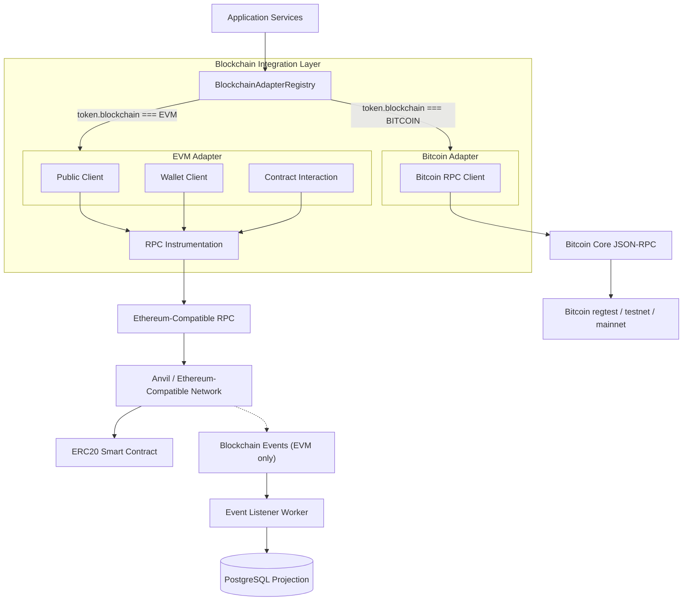
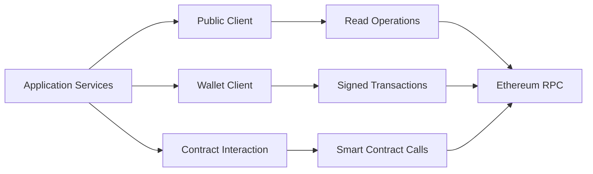
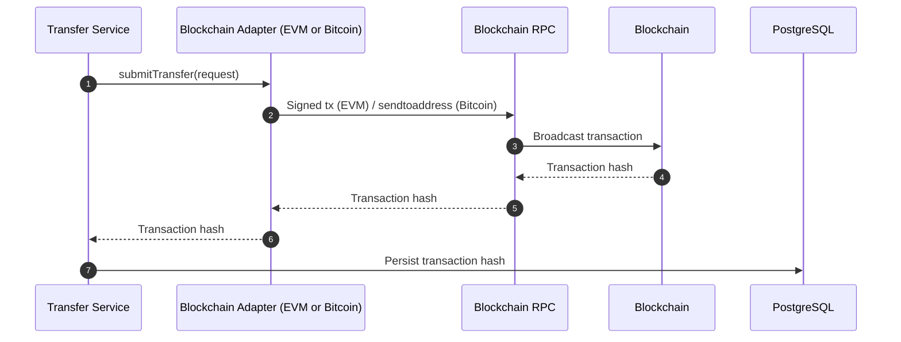
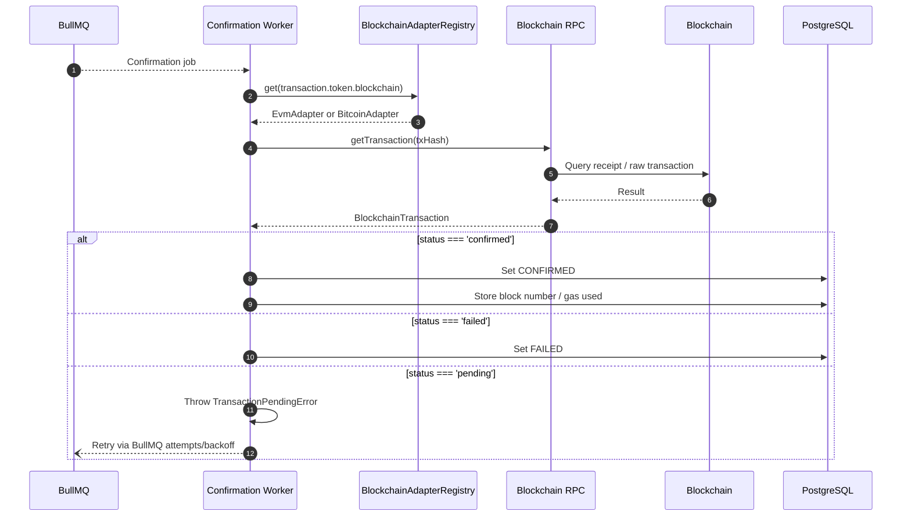
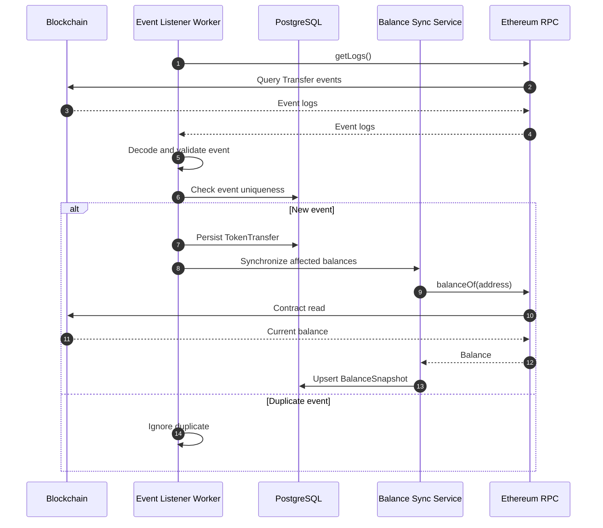
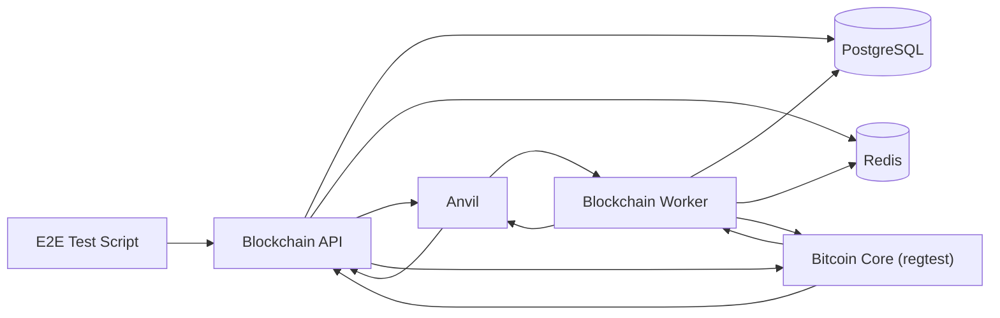

# Blockchain Integration Architecture

## Overview

The Blockchain Transaction Simulator integrates with multiple blockchain networks to execute transactions, monitor confirmations, process blockchain events, and synchronize blockchain-derived state into PostgreSQL.

The platform originally supported only Ethereum-compatible (EVM) networks. It now also supports **Bitcoin**, selected per-token through a `Blockchain` enum (`EVM` | `BITCOIN`) rather than being hardcoded to one network. A `Token` record declares which chain it lives on, and every transfer of that token is routed to the matching chain implementation automatically.

The blockchain integration layer isolates blockchain-specific concerns from application business logic, and now also isolates **chain-specific** concerns from each other, so that adding Bitcoin did not require touching EVM code paths (or vice versa).

The design separates:

* Blockchain adapter selection (which chain a token belongs to)
* Blockchain client creation
* Wallet signing / transfer submission
* Smart contract interaction (EVM only)
* RPC communication
* Transaction submission
* Transaction confirmation
* Event indexing (EVM only today — see [Event Processing](#event-processing))
* Balance synchronization (EVM only today)
* RPC observability

The blockchain remains the authoritative source for on-chain state, while PostgreSQL maintains application state and durable projections of blockchain activity.

---

# Blockchain Architecture



The blockchain integration layer provides the boundary between application services and the external blockchain network(s). Application code calls `BlockchainAdapterRegistry.get(chain)` and interacts with the returned `BlockchainAdapter` — it never imports `viem` or the Bitcoin RPC client directly.

---

# Technology Stack

| Component                | Technology                                    |
| ------------------------- | ---------------------------------------------- |
| EVM Blockchain Client     | viem                                          |
| EVM Local Blockchain      | Anvil                                         |
| EVM Contract Tooling      | Hardhat                                       |
| EVM Smart Contracts       | Solidity                                      |
| EVM Network Interface     | Ethereum JSON-RPC                             |
| EVM Token                 | MiniUSDT (ERC20, 6 decimals)                  |
| EVM Chain ID               | 31337 for local Anvil                         |
| Bitcoin Client             | Custom lightweight Bitcoin Core JSON-RPC client (`src/blockchain/bitcoin/rpc.client.ts`) |
| Bitcoin Node               | Bitcoin Core                                  |
| Bitcoin Network Interface  | Bitcoin Core JSON-RPC (`sendtoaddress`, `getrawtransaction`) |
| Bitcoin Local Network      | Bitcoin Core in `-regtest` mode                |
| Bitcoin Unit               | satoshi (application) / BTC (wire format to RPC) |

Unlike the EVM side, the Bitcoin integration does not use a third-party SDK — the JSON-RPC calls it needs (`sendtoaddress`, `getrawtransaction`) are simple enough that a small hand-written client was used instead of pulling in a full Bitcoin library.

---

# Blockchain Responsibilities

The blockchain layer is responsible for:

* Selecting the correct chain adapter for a given token
* Creating blockchain clients
* Reading blockchain state
* Signing transactions (EVM) / delegating to node-wallet custody (Bitcoin)
* Sending transactions
* Calling smart contracts (EVM)
* Retrieving transaction receipts / raw transactions
* Reading blockchain logs (EVM)
* Decoding blockchain events (EVM)
* Providing RPC instrumentation

It does not contain:

* HTTP routing
* Authentication
* Authorization
* API response formatting
* Database business workflows
* User management
* Application-level transaction orchestration

---

# The Blockchain Adapter Abstraction

Every chain implements the same interface, defined in `src/blockchain/blockchain-adapter.ts`:

```typescript
interface BlockchainAdapter {
    readonly chain: string; // 'EVM' | 'BITCOIN'

    submitTransfer(request: TransferRequest): Promise<TransferSubmission>;
    getTransaction(txHash: string): Promise<BlockchainTransaction>;
}
```

`TransferRequest` and `BlockchainTransaction` are chain-agnostic shapes. Fields that only make sense for one chain family are optional or nullable rather than being split into per-chain types:

* `TransferRequest.assetIdentifier` — the ERC20 contract address for EVM transfers; unused by the Bitcoin adapter (Bitcoin has no contract/asset identifier — it only ever moves the base asset).
* `BlockchainTransaction.gasUsed` — populated for EVM, always `null` for Bitcoin (Bitcoin has no gas concept).
* `BlockchainTransaction.blockNumber` — populated once a transaction is included in a block on either chain; `null` while unconfirmed.

`BlockchainAdapterRegistry` (`src/blockchain/blockchain-adapter.registry.ts`) holds one adapter instance per chain and dispatches by chain name:

```typescript
class BlockchainAdapterRegistry {
    constructor(private readonly adapters: BlockchainAdapter[]) {}

    get(chain: string): BlockchainAdapter {
        const adapter = this.adapters.find(
            (candidate) => candidate.chain === chain.toUpperCase(),
        );

        if (!adapter) {
            throw new Error(`No blockchain adapter registered for chain: ${chain}`);
        }

        return adapter;
    }
}
```

The registry is populated once, in `src/blockchain/blockchain-adapters.ts`:

```typescript
export const blockchainAdapterRegistry = new BlockchainAdapterRegistry([
    new EvmAdapter(new SignerService(new WalletRepository())),
    new BitcoinAdapter(new BitcoinRpcClient()),
]);
```

## How a chain is chosen for a transfer

Chain selection is data-driven, not caller-driven. Each `Token` row carries a `blockchain` column (`EVM` or `BITCOIN`, Prisma migration `20260912131829_add_blockchain_to_token`), defaulting to `EVM` for pre-existing tokens. `TokenTransferService` (via `TransferService`) looks up the token being transferred and resolves the adapter from its `blockchain` field:

```text
Transfer Request
       |
       v
TokenService.getToken(tokenId)
       |
       v
token.blockchain  ("EVM" | "BITCOIN")
       |
       v
blockchainRegistry.get(token.blockchain)
       |
       v
EvmAdapter  or  BitcoinAdapter
```

The same pattern is used by the Confirmation Worker (`src/workers/confirmation.processor.ts`), which resolves the adapter from `transaction.token.blockchain` rather than assuming EVM.

Because of this, **adding a chain is a two-step change**: implement `BlockchainAdapter`, and register the instance in `blockchain-adapters.ts`. No caller of `blockchainRegistry.get(...)` needs to change.

---

# EVM Adapter

The EVM adapter (`src/blockchain/evm/evm.adapter.ts`, `chain = 'EVM'`) is the original implementation and remains the default for existing tokens.

## Client Architecture

The application uses different viem client capabilities depending on the operation.



## Public Client

The Public Client is used for blockchain read operations.

Examples include:

* Transaction receipt retrieval
* Contract state queries
* ERC20 balance queries
* Event log retrieval
* Blockchain reads

Typical operations include:

```text
getTransactionReceipt()

readContract()

getLogs()

getBlockNumber()
```

The Public Client does not sign transactions.

## Wallet Client

The Wallet Client is used for blockchain write operations. It is created per-transfer through `SignerService`, which resolves the custodial wallet's key material for the requesting `walletId`/`tenantId` — the EVM adapter never handles raw key material itself.

Responsibilities include:

* Signing transactions
* Sending transactions
* Executing contract write methods
* Managing the account used for blockchain transactions

Example flow:

```text
Application
    |
    v
Transfer Service
    |
    v
EvmAdapter.submitTransfer()
    |
    v
SignerService.getWalletClientFor(walletId, tenantId)
    |
    v
Wallet Client
    |
    v
Signed Transaction
    |
    v
Ethereum RPC
    |
    v
Blockchain
```

Private keys are provided through runtime configuration and are not persisted as application data.

## Smart Contract Integration

The project currently interacts with an ERC20-compatible token contract, `MiniUSDT`.

The contract uses 6 decimal places and provides token operations used by the simulator.

`EvmAdapter.submitTransfer` requires `request.assetIdentifier` (the token's `contractAddress`) and throws if it is missing — this is how the adapter enforces that only EVM tokens are routed through it in practice, even though the type itself is optional.

## Token Minting

The token mint operation follows this pattern:

```text
Mint Request
     |
     v
Mint Service
     |
     v
Contract Write
     |
     v
Wallet Client
     |
     v
Ethereum RPC
     |
     v
MiniUSDT Contract
     |
     v
ERC20 Transfer Event
```

The resulting blockchain transaction can subsequently be observed by the event listener. Minting is EVM-specific; there is no Bitcoin equivalent (Bitcoin has no mintable token layer in this integration — see [Bitcoin Adapter](#bitcoin-adapter)).

## Token Transfer

The transfer flow is:

```text
Transfer Request
       |
       v
Transaction Service
       |
       v
Transfer Service
       |
       v
BlockchainAdapterRegistry.get('EVM')
       |
       v
EvmAdapter -> Wallet Client
       |
       v
MiniUSDT Contract
       |
       v
Blockchain Transaction
       |
       v
ERC20 Transfer Event
```

The transaction hash returned by the blockchain is persisted against the application's transaction record, the same way it is for Bitcoin transfers — this part of the flow is chain-agnostic.

---

# Bitcoin Adapter

The Bitcoin adapter (`src/blockchain/bitcoin/bitcoin.adapter.ts`, `chain = 'BITCOIN'`) talks to a Bitcoin Core node over its JSON-RPC interface. It is intentionally minimal: it implements exactly the two `BlockchainAdapter` methods, using two RPC calls.

## Bitcoin RPC Client

`BitcoinRpcClient` (`src/blockchain/bitcoin/rpc.client.ts`) is a small hand-rolled JSON-RPC 1.0 client, not a wrapped SDK:

* Sends `POST` requests with HTTP Basic auth built from `BITCOIN_RPC_USER` / `BITCOIN_RPC_PASSWORD`.
* Supports two URL modes: the node's base RPC URL for wallet-agnostic calls, and `{RPC_URL}/wallet/{BITCOIN_RPC_WALLET}` for calls that must run against a specific loaded wallet (Bitcoin Core supports multiple wallets per node; `submitTransfer` always calls with `wallet = true`).
* Surfaces both HTTP-level failures (non-2xx status) and JSON-RPC-level failures (a non-null `error` field in the response body) as thrown `Error`s, so callers don't need to inspect the response shape themselves.

## Configuration

Bitcoin configuration is validated independently of the main application config (`src/config/env.ts`), through its own Zod schema in `src/blockchain/bitcoin/config.ts`:

```env
BITCOIN_RPC_URL=http://localhost:18443
BITCOIN_RPC_USER=<rpc username>
BITCOIN_RPC_PASSWORD=<rpc password>
BITCOIN_RPC_WALLET=<name of the loaded wallet to send from>
BITCOIN_NETWORK=regtest   # regtest | testnet | mainnet, defaults to regtest
```

`getBitcoinConfig()` throws immediately if any of these are missing or malformed, rather than allowing a Bitcoin transfer to proceed against an unconfigured node.

## Submitting a Transfer

```typescript
async submitTransfer(request: TransferRequest): Promise<TransferSubmission> {
    const txHash = await this.rpc.call<string>(
        'sendtoaddress',
        [request.toAddress, satoshisToBtc(request.amount)],
        true, // run against BITCOIN_RPC_WALLET
    );

    return { txHash };
}
```

Amounts inside the application are always integer satoshis (`bigint`), consistent with how amounts are stored for every token regardless of chain. Bitcoin Core's `sendtoaddress` RPC expects a decimal BTC amount, so the adapter converts at the RPC boundary:

```typescript
function satoshisToBtc(amount: bigint): number {
    if (amount < 0n) throw new Error('Bitcoin transfer amount cannot be negative');
    if (amount > 21_000_000n * 100_000_000n) {
        throw new Error('Bitcoin transfer amount exceeds maximum supply');
    }
    return Number(amount) / 100_000_000;
}
```

The 21,000,000 BTC supply cap is checked before the RPC call is made, both as a sanity check and to fail fast on a clearly-invalid amount without spending an RPC round trip.

## Reading a Transaction

```typescript
async getTransaction(txHash: string): Promise<BlockchainTransaction> {
    const transaction = await this.rpc.call<BitcoinTransaction>('getrawtransaction', [
        txHash,
        true, // verbose
    ]);

    const confirmations = transaction.confirmations ?? 0;

    // getrawtransaction's verbose result has no blockheight field — only
    // blockhash. Resolve the height via getblockheader, and only once
    // the transaction is actually confirmed, so the common "still
    // pending" poll stays a single RPC call.
    const blockNumber =
        confirmations > 0 && transaction.blockhash
            ? BigInt(
                  (
                      await this.rpc.call<{ height: number }>('getblockheader', [
                          transaction.blockhash,
                      ])
                  ).height,
              )
            : null;

    return {
        txHash,
        blockNumber,
        confirmations,
        status: confirmations > 0 ? 'confirmed' : 'pending',
        gasUsed: null,
    };
}
```

`getrawtransaction` with `verbose = true` omits `confirmations`/`blockhash` entirely for a transaction that is still only in the mempool, which is why `confirmations` defaults to `0` rather than being read as `undefined`.

**Why not read a `blockheight` field directly?** An earlier version of this adapter did exactly that — but `getrawtransaction` does not return a `blockheight` field at all (verified against Bitcoin Core's RPC docs across versions 22–31; `blockheight` exists only on the wallet-scoped `gettransaction` RPC, which this adapter deliberately doesn't call — see [Custody Model](#custody-model--an-important-difference-from-evm)). That meant every genuinely confirmed Bitcoin transaction resolved `blockNumber: null`, which failed the Confirmation Worker's "confirmed transaction has no block number" guard on every poll — and because the transaction had already been claimed into `CONFIRMING` before that guard ran, it stayed there forever rather than reaching `CONFIRMED` or any other terminal state. This is fixed as of [ADR-010](decisions/010-tri-state-confirmation-status.md); the `getblockheader` call above is the fix.

## Custody Model — an Important Difference from EVM

The Bitcoin and EVM adapters use **different custody models**, and this is the most significant behavioral difference between them:

* **EVM**: each custodial wallet has its own key, resolved per-transfer by `SignerService` from `WalletRepository`/KMS. `request.walletId` determines which key signs the transaction.
* **Bitcoin**: `request.walletId` is accepted (to satisfy the shared `TransferRequest` shape) but **is not used**. Every Bitcoin transfer is sent from the single wallet named by `BITCOIN_RPC_WALLET` on the configured node — funds are custodied by Bitcoin Core itself, not by this application's per-wallet key infrastructure.

In practice, this means all of a tenant's (indeed, all tenants') Bitcoin token balances share one underlying Bitcoin Core wallet today. The application-level `Wallet` record still exists and still has an address for receiving/tracking purposes, but outbound Bitcoin transfers are not cryptographically isolated per application wallet the way EVM transfers are. Anyone extending Bitcoin support to per-wallet custody would need to move key management for Bitcoin into the application (e.g. one Bitcoin Core wallet per custodial wallet, or a descriptor/PSBT-based signing flow) rather than relying on a single node wallet.

**This was revisited, not just left, in [ADR-010](decisions/010-tri-state-confirmation-status.md).** The shared-wallet model is being kept deliberately for now — no production Bitcoin funds are custodied by this platform yet, and building per-wallet custody is scoped as comparable in size to the Bitcoin adapter itself — rather than being an unexamined leftover from the original scoping. It remains tracked in [Future Improvements](#future-improvements) below, and should be resolved before this adapter is used for non-trivial value.

## Confirmation Semantics — Another Difference from EVM

`status` is populated differently on each chain, reflecting genuinely different transaction-finality models — this was a deliberate tri-state design (`'pending' | 'confirmed' | 'failed'`, see [ADR-010](decisions/010-tri-state-confirmation-status.md)), not an incidental one:

* **EVM**: a receipt only exists once the transaction is mined — `getTransactionReceipt` throws for a transaction that isn't mined yet (handled as a retryable "not found yet" case, see below), so every receipt this method actually returns is terminal: `status: receipt.status === 'success' ? 'confirmed' : 'failed'`. EVM never returns `'pending'` from this method.
* **Bitcoin**: `getrawtransaction` does **not** throw for an unconfirmed (mempool-only) transaction — it simply returns it without a `confirmations` field, which the adapter maps to `confirmations = 0` and `status: 'pending'`. `status: 'confirmed'` once `confirmations > 0`. A `'failed'` status isn't reachable from this method today — Bitcoin has no on-chain revert once confirmed, and a transaction that never confirms and drops from the mempool instead surfaces as an RPC "not found" error (handled the same as EVM's "not found," below).

The Confirmation Worker (`src/workers/confirmation.processor.ts`) switches on `status`: `'confirmed'` → mark the transaction `CONFIRMED`; `'failed'` → mark it `FAILED`; `'pending'` → throw a `TransactionPendingError` (`src/common/errors/transaction-pending.error.ts`), which `handleConfirmationError` treats exactly like viem's "receipt not found yet" error — retried via the job's normal BullMQ attempts/backoff (`src/queues/transaction.queue.ts`), with `ExpirationProcessor` as the eventual backstop if a transaction never leaves `pending`. `handleConfirmationError` also recognizes Bitcoin Core's own "not found" RPC message (`"No such mempool or blockchain transaction..."`) as retryable, alongside viem's message, so a Bitcoin transaction not yet visible to the node at all doesn't inflate the genuine-failure metric on ordinary polling either.

**Before ADR-010, this was a known gap**: an unconfirmed Bitcoin transaction reported the same `success: false` a genuine revert would, and got marked `FAILED` on the very first poll. That's fixed. If you're reading older commentary elsewhere (or an earlier version of this document) describing Bitcoin transactions as unreliable to confirm, that referred to this gap, which no longer applies.

---

# Transaction Submission Flow

The blockchain submission lifecycle (shown here for EVM; Bitcoin follows the same shape with `BitcoinAdapter`/`sendtoaddress` standing in for the Wallet Client/`writeContract` step):



A successful submission only means that the blockchain accepted the transaction for processing.

It does **not** mean that the transaction has been confirmed.

---

# Transaction Hash Persistence

The application maintains a relationship between the internal transaction and the blockchain transaction, independent of which chain it settled on.

```text
Application Transaction
        |
        +-- Internal Transaction ID
        |
        +-- Status
        |
        +-- Confirmation Metadata
        |
        +-- token.blockchain ("EVM" | "BITCOIN")
        |
        +-- Blockchain Transaction Hash
                         |
                         v
                  Blockchain Transaction
```

The internal transaction ID identifies the application's transaction.

The blockchain transaction hash identifies the corresponding on-chain transaction, and `token.blockchain` identifies which adapter/network it should be looked up against.

---

# Transaction Confirmation

Blockchain transactions are asynchronous.

After submission, the Confirmation Worker is responsible for monitoring the transaction, using whichever adapter matches `transaction.token.blockchain`.



See [Confirmation Semantics — Another Difference from EVM](#confirmation-semantics--another-difference-from-evm) above for how each chain populates `status`, and [ADR-010](decisions/010-tri-state-confirmation-status.md) for why this is a three-way branch rather than the boolean it used to be.

The Confirmation Worker therefore separates transaction submission from transaction confirmation.

---

# Transaction Confirmation Lifecycle

The blockchain-facing lifecycle is:

```text
PENDING
   |
   v
SUBMITTED
   |
   v
CONFIRMING
   |
   +------------------+
   |                  |
   v                  v
CONFIRMED           FAILED
   |
   v
Blockchain Event (EVM only)
```

A transaction can also terminate as `EXPIRED` when the configured confirmation deadline is exceeded. This applies identically regardless of chain.

The complete lifecycle is documented in:

```text
docs/transaction-lifecycle.md
```

---

# Nonce Management (EVM only)

Blockchain transactions from the same EVM account require correct nonce sequencing. Bitcoin's UTXO model has no equivalent concept — a Bitcoin Core wallet selects unspent outputs per call rather than incrementing an account nonce, so nothing below applies to the Bitcoin adapter.

The application therefore treats nonce management as part of the EVM transaction submission boundary.

```text
Transaction Request
       |
       v
Wallet / Account
       |
       v
Nonce Management
       |
       v
Signed Transaction
       |
       v
Blockchain RPC
```

Nonce-related failures can occur when:

* A nonce is reused
* A transaction is submitted with an outdated nonce
* Multiple transactions are submitted concurrently
* Local application state diverges from blockchain account state

Nonce management must therefore remain coordinated with the blockchain account's current nonce.

This is particularly important for concurrent transaction submission and E2E testing. See `docs/decisions/006-blockchain-nonce-management.md` for the full rationale; that ADR predates the Bitcoin adapter and is scoped entirely to EVM.

The Bitcoin adapter has its own, much simpler, concurrency consideration instead: because every Bitcoin transfer draws from the same node wallet (`BITCOIN_RPC_WALLET`), concurrent `sendtoaddress` calls rely on Bitcoin Core's own internal UTXO selection and locking rather than any nonce manager in this codebase.

---

# RPC Communication

The application now communicates with two different RPC dialects, one per chain family.

## Ethereum-Compatible JSON-RPC (EVM)

Representative operations include:

```text
eth_sendRawTransaction

eth_getTransactionReceipt

eth_getLogs

eth_call

eth_getTransactionCount
```

## Bitcoin Core JSON-RPC (Bitcoin)

Representative operations include:

```text
sendtoaddress

getrawtransaction

getblockchaininfo   (used by health/readiness tooling, e.g. test/e2e/helpers/bitcoin.ts)
```

Bitcoin Core's JSON-RPC uses `jsonrpc: "1.0"` framing rather than the `2.0` framing common elsewhere, which is why `BitcoinRpcClient` builds its own request/response types instead of reusing anything from the EVM RPC stack.

## Shared Expectations

Regardless of chain, the application treats RPC as an external dependency and therefore expects:

* Latency
* Temporary failures
* Network interruptions
* Provider errors
* Rate limits

---

# RPC Instrumentation

RPC calls made through the EVM adapter are instrumented through:

```text
src/blockchain/rpc.instrumentation.ts
```

The purpose is to make blockchain communication observable.

The instrumentation captures information such as:

* RPC latency
* RPC failures
* Operation type
* Error context

Flow:

```text
RPC Request
     |
     v
RPC Instrumentation
     |
     +----------------------+
     |                      |
     v                      v
Execute RPC Call       Record Metrics
     |
     v
Return Result
```

This allows blockchain infrastructure problems to be distinguished from application-level failures.

**`BitcoinRpcClient` calls are not currently wrapped by this instrumentation layer.** Bitcoin RPC calls are not yet broken out separately in Prometheus metrics or given their own spans the way EVM RPC calls are — see [Current Architecture Boundaries](#current-architecture-boundaries).

---

# Event Processing

Blockchain events are consumed asynchronously by the Event Listener Worker — **for EVM only, today.**

For ERC20 transfers:

```text
Blockchain Block
       |
       v
ERC20 Transfer Event
       |
       v
Event Listener Worker
       |
       v
Validate / Decode Event
       |
       v
TokenTransfer
       |
       v
Balance Synchronization
```

The Bitcoin adapter has no equivalent listener. Bitcoin transactions are tracked purely through the request/response cycle (`submitTransfer` → `getTransaction` polling by the Confirmation Worker); there is no background process consuming Bitcoin blocks or mempool activity, no `TokenTransfer` records are created for Bitcoin transfers from chain data, and there is no `BalanceSnapshot` synchronization for Bitcoin balances. Everything below this point in this document (Event Listener Architecture, ERC20 Transfer Events, Event Idempotency, Balance Synchronization) describes EVM-only behavior unless stated otherwise.

---

# Event Listener Architecture (EVM only)



---

# ERC20 Transfer Events (EVM only)

The simulator uses ERC20 `Transfer` events as an input to the application projection.

Conceptually:

```text
Transfer(
    from,
    to,
    value
)
```

The listener extracts relevant event information and persists the transfer as an application record.

Blockchain event coordinates are used to prevent duplicate processing.

---

# Event Idempotency (EVM only)

Event processing must tolerate duplicate delivery.

An ERC20 event can be identified using blockchain-specific coordinates including:

```text
Transaction Hash
+
Log Index
```

Conceptually:

```text
Event
 |
 +-- Transaction Hash
 |
 +-- Log Index
 |
 v
Unique Event Identity
 |
 v
TokenTransfer
```

If the same event is encountered again, the listener should not create another logical transfer record.

This protects the system against:

* Worker retries
* Worker restarts
* Event replay
* Duplicate log retrieval

---

# Blockchain State Synchronization

The blockchain is the authoritative source for blockchain-derived state.

PostgreSQL acts as an application projection.


This means the system separates:

```text
Blockchain
    |
    +-- Authoritative on-chain state

PostgreSQL
    |
    +-- Application state
    +-- Transaction lifecycle
    +-- Event projections (EVM)
    +-- Balance snapshots (EVM)
```

For Bitcoin, the transaction lifecycle (`PENDING` → ... → `CONFIRMED`/`FAILED`/`EXPIRED`) is still tracked in PostgreSQL, but there is no event projection or balance snapshot layer sitting on top of it yet.

---

# Balance Synchronization (EVM only)

Balance snapshots are derived from the blockchain.

The synchronization process is:

```text
Transfer Event
      |
      v
Affected Address
      |
      v
Balance Sync Service
      |
      v
ERC20 balanceOf()
      |
      v
Current On-Chain Balance
      |
      v
BalanceSnapshot
```

The snapshot allows application queries to use PostgreSQL without requiring a live RPC call for every balance request.

The blockchain remains authoritative.

There is currently no Bitcoin equivalent of `BalanceSnapshot`; a Bitcoin balance would need to be queried live (e.g. via `listunspent`/`getbalance` against the node wallet) rather than read from a projection. See [Future Improvements](#future-improvements).

---

# Failure Handling

Blockchain integration is treated as a failure-prone external dependency, for every chain.

Failures can occur during:

* Transaction submission
* RPC communication
* Receipt / raw-transaction retrieval
* Event retrieval (EVM)
* Contract reads/writes (EVM)
* Nonce acquisition (EVM)
* Balance synchronization (EVM)

The system uses logging, metrics, retry mechanisms, and durable state to support recovery.

---

# RPC Failure

Examples:

* Provider/node unavailable
* Network timeout
* Connection failure
* Rate limiting
* RPC error response

Handling includes:

* Capture failure metrics (EVM adapter; not yet instrumented for Bitcoin — see [RPC Instrumentation](#rpc-instrumentation))
* Log structured error context
* Allow worker retry behavior where appropriate
* Preserve transaction state
* Avoid falsely marking transactions as confirmed

---

# Transaction Submission Failure

Examples:

* Contract revert during simulation (EVM)
* Invalid transaction parameters
* Insufficient funds
* Invalid nonce (EVM)
* Insufficient confirmed UTXOs in the node wallet (Bitcoin)
* RPC rejection

Handling:

```text
Submission Failure
       |
       v
Capture Error
       |
       v
Structured Logging
       |
       v
Transaction Failure Handling
```

The application preserves enough context to diagnose the failed submission.

---

# Confirmation Failure

A transaction may be submitted successfully but remain unconfirmed.

Possible causes include:

* Blockchain congestion
* RPC visibility problems
* Temporary provider failure
* Transaction replacement (EVM: replace-by-fee; Bitcoin: RBF if enabled on the node)
* Network interruption

The Confirmation Worker retries receipt retrieval according to the configured job retry/backoff policy.

If the confirmation deadline is exceeded, the application can transition the transaction to `EXPIRED`. For Bitcoin specifically, remember that today an unconfirmed transaction can also be marked `FAILED` on the very first poll (see [Confirmation Semantics](#confirmation-semantics--another-difference-from-evm)) — in practice this means `EXPIRED` is rarely reached for Bitcoin transfers in the current implementation, because `FAILED` is reached first.

---

# Event Processing Failure (EVM only)

Examples:

* PostgreSQL unavailable
* RPC unavailable
* Malformed/unexpected event
* Worker restart
* Temporary processing error

Handling includes:

* Retry processing
* Preserve event identity
* Prevent duplicate projections
* Maintain durable database state
* Allow processing to resume after worker restart

---

# Local Blockchain Development

## EVM: Anvil

The project uses Anvil as the local Ethereum-compatible blockchain, started via `docker-compose.yml`.

Advantages include:

* Fast block creation
* Deterministic development accounts
* Local private keys
* Ethereum compatibility
* Fast integration and E2E testing

Development flow:

```text
Start Anvil
     |
     v
Deploy Contracts
     |
     v
Configure Contract Addresses
     |
     v
Start Application
     |
     v
Execute Transactions
     |
     v
Observe Confirmations / Events
```

## Bitcoin: regtest

Bitcoin Core running in `-regtest` mode is the local/E2E analogue of Anvil. **Unlike Anvil, it is only wired into `docker-compose.e2e.yml` today — the everyday local development compose file (`docker-compose.yml`) does not start a Bitcoin node.** A developer working on Bitcoin transfers outside of the E2E suite needs to either run a `bitcoin/bitcoin` container manually (matching the flags in `docker-compose.e2e.yml`: `-regtest=1 -server=1 -txindex=1 -rpcuser=... -rpcpassword=...`) or add a `bitcoin` service to their local compose override, and point `BITCOIN_RPC_URL`/`BITCOIN_RPC_USER`/`BITCOIN_RPC_PASSWORD`/`BITCOIN_RPC_WALLET` at it.

The E2E compose service:

```yaml
bitcoin:
    image: bitcoin/bitcoin:29.0
    command:
        - -regtest=1
        - -server=1
        - -txindex=1
        - -fallbackfee=0.0002
        - -rpcbind=0.0.0.0
        - -rpcallowip=0.0.0.0/0
        - -rpcuser=e2e
        - -rpcpassword=e2e-password
        - -acceptnonstdtxn=1
    healthcheck:
        test: ['CMD', 'bitcoin-cli', '-regtest', '-rpcuser=e2e', '-rpcpassword=e2e-password', 'getblockchaininfo']
```

`-txindex=1` is required because `getrawtransaction` (which the adapter's `getTransaction` uses) needs the full transaction index to look up arbitrary transactions by hash rather than only ones belonging to the node's own wallet.

`test/e2e/helpers/bitcoin.ts` provides `waitForBitcoin(...)`, mirroring the readiness-wait pattern E2E tests already use for Anvil, so the API/worker containers don't start submitting Bitcoin transfers before the regtest node has finished initializing.

---

# Local E2E Architecture

The E2E environment uses isolated infrastructure for blockchain transaction testing, now covering both chains.



The E2E environment verifies the complete transaction path rather than testing individual services in isolation. `test/e2e/bitcoin.adapter.e2e.test.ts` exercises the Bitcoin path specifically, submitting a transfer against the regtest node and polling for confirmation the same way the application's Confirmation Worker does.

---

# Smart Contract Deployment (EVM only)

The local deployment lifecycle is:

```text
Solidity Contract
       |
       v
Hardhat / Deployment Tooling
       |
       v
Anvil
       |
       v
Contract Address
       |
       v
Application Configuration
```

The application consumes deployed contract addresses through configuration.

Deployment logic itself remains outside the runtime blockchain integration layer.

Bitcoin has no equivalent step — there is no contract to deploy, and `Token.contractAddress` is `null` for Bitcoin tokens (the column was made nullable specifically to allow this, in the same migration that added the `blockchain` column).

---

# Contract / Chain Configuration

Contract addresses and blockchain configuration are runtime concerns.

Typical EVM configuration includes:

```text
RPC_URL
CHAIN_ID
TOKEN_CONTRACT_ADDRESS
DEPLOYER_PRIVATE_KEY
```

Typical Bitcoin configuration includes:

```text
BITCOIN_RPC_URL
BITCOIN_RPC_USER
BITCOIN_RPC_PASSWORD
BITCOIN_RPC_WALLET
BITCOIN_NETWORK
```

Secrets such as private keys and RPC credentials must be supplied through secure runtime configuration.

They should not be stored in PostgreSQL.

---

# Security Considerations

## Private Keys and Node Credentials

Neither EVM private keys nor Bitcoin RPC credentials should ever be:

* Stored in source code
* Committed to Git
* Logged
* Stored in application database tables
* Exposed through API responses

Development environments may use deterministic Anvil accounts and the fixed E2E Bitcoin regtest credentials (`e2e` / `e2e-password`) — these are intentionally not secrets and must never be reused outside local/E2E environments.

Production environments should use stronger key-management mechanisms such as:

* Secret managers
* Hardware-backed signing
* Dedicated signing services
* Managed wallet infrastructure

## Bitcoin's Shared Node-Wallet Custody

Because every Bitcoin transfer draws from one Bitcoin Core wallet (`BITCOIN_RPC_WALLET`) rather than a per-application-wallet key, the Bitcoin RPC credentials are effectively the single control point for all Bitcoin funds custodied by the platform — there is no per-tenant or per-wallet blast-radius limitation the way there is for EVM (where compromising one custodial key only exposes that wallet). This makes `BITCOIN_RPC_URL`/`BITCOIN_RPC_USER`/`BITCOIN_RPC_PASSWORD`/`BITCOIN_RPC_WALLET` especially high-value secrets in any deployment that holds real Bitcoin funds, and is a reason to prioritize per-wallet Bitcoin custody (see [Future Improvements](#future-improvements)) before this adapter is used with non-trivial value.

## RPC Security

Production RPC infrastructure — for both the EVM RPC endpoint and the Bitcoin Core node — should consider:

* Authentication
* TLS
* Rate limits
* Provider/node redundancy
* Network access controls
* Provider/node monitoring
* Credential rotation

The application should not assume that a blockchain RPC endpoint is always available.

---

# Blockchain and Database Consistency

The architecture intentionally separates blockchain truth from application projections.

```text
Blockchain
    |
    | authoritative
    v
Event / Receipt / Raw Transaction
    |
    v
Application Processing
    |
    v
PostgreSQL Projection
```

Temporary divergence is therefore possible.

For example:

```text
Blockchain:
Transaction CONFIRMED

PostgreSQL:
Transaction CONFIRMING
```

This can occur briefly while the confirmation worker is processing the receipt/raw transaction.

Likewise, for EVM specifically:

```text
Blockchain:
Transfer Event Exists

PostgreSQL:
TokenTransfer Not Yet Persisted
```

can occur while the event listener is processing the event. There is no Bitcoin equivalent of this specific divergence today, since Bitcoin has no event listener or `TokenTransfer` projection.

This is expected eventual consistency rather than an architectural inconsistency.

---

# Observability

Blockchain integration must be observable independently from application logic, and — ideally — independently per chain.

Important signals include:

```text
RPC latency
RPC error rate
Transaction submission failures
Transaction confirmation latency
Confirmation failures
Event processing failures (EVM)
Balance synchronization failures (EVM)
Nonce errors (EVM)
```

The EVM integration layer contributes metrics to the application's Prometheus registry via `rpc.instrumentation.ts`. **The Bitcoin adapter does not yet contribute chain-specific metrics or spans** — Bitcoin RPC calls are currently only visible through generic application logs and whatever metrics the Confirmation Worker itself records, not broken out as `chain="BITCOIN"` the way EVM RPC calls are broken out today. See [Future Improvements](#future-improvements).

Structured logs should include relevant context such as:

```text
transactionId
transactionHash
walletAddress
chainId / chain
contractAddress
RPC operation
error
```

Sensitive credentials must never appear in logs.

---

# Design Principles

## Blockchain Isolation

Application services should not directly depend on low-level RPC implementation details, for any chain.

Blockchain communication belongs behind the blockchain integration boundary — specifically, behind `BlockchainAdapter`.

---

## Chain Isolation

Chain-specific concerns (viem, EVM contract ABIs, Bitcoin Core's JSON-RPC 1.0 framing) belong behind each adapter, not leaked into `TransferService`, `ConfirmationProcessor`, or any other caller. Those callers only depend on `BlockchainAdapter`/`BlockchainAdapterRegistry` and the chain-agnostic `TransferRequest`/`BlockchainTransaction` shapes.

---

## External System Awareness

Blockchain operations are treated as:

* Slow
* Asynchronous
* Failure-prone
* Eventually observable

A submitted transaction is not equivalent to a confirmed transaction, on either chain.

---

## Explicit Transaction Lifecycle

The application distinguishes between:

```text
Application Transaction
        |
        v
Blockchain Submission
        |
        v
Blockchain Confirmation
        |
        v
Blockchain Event (EVM only)
        |
        v
Application Projection (EVM only)
```

Each stage can fail independently.

---

## Idempotent Processing

Blockchain workflows must be safe to retry.

This applies to:

* Confirmation jobs (both chains)
* Event processing (EVM)
* Balance synchronization (EVM)
* Worker execution (both chains)

---

## Observable Integration

Blockchain operations should provide:

* Structured logs
* Metrics
* Correlation context
* Transaction context
* RPC failure information

Bitcoin currently falls short of this principle relative to EVM (see [Observability](#observability)); closing that gap is tracked in [Future Improvements](#future-improvements).

---

# Current Architecture Boundaries

The current implementation supports:

* A chain-agnostic `BlockchainAdapter` interface with a `BlockchainAdapterRegistry`
* Two registered chains: EVM and Bitcoin, selected per-token via `Token.blockchain`
* Ethereum-compatible RPC (EVM adapter)
* Anvil local blockchain (EVM)
* viem blockchain clients (EVM)
* ERC20 contract interaction (EVM)
* Bitcoin Core JSON-RPC (Bitcoin adapter)
* Bitcoin regtest, wired into the E2E compose stack (Bitcoin)
* Transaction submission on both chains
* Receipt/raw-transaction-based confirmation on both chains
* ERC20 event processing (EVM only)
* Balance synchronization (EVM only)
* RPC instrumentation (EVM only)
* Background confirmation processing (both chains, via the same `ConfirmationProcessor`)

The following are **known, currently-accepted gaps in Bitcoin support** — deliberate deferrals, not oversights, but still gaps:

* **Bitcoin custody is a single shared node wallet**, not per-application-wallet keys. `request.walletId` is ignored by `BitcoinAdapter.submitTransfer`. Revisited (and deliberately kept, for now) in [ADR-010](decisions/010-tri-state-confirmation-status.md). See [Custody Model](#custody-model--an-important-difference-from-evm).
* **No Bitcoin event listener or balance synchronization.** There is no `TokenTransfer`/`BalanceSnapshot` equivalent fed from Bitcoin chain data.
* **No Bitcoin RPC instrumentation.** Bitcoin RPC calls aren't wrapped by `rpc.instrumentation.ts` and don't appear in the same Prometheus metrics as EVM RPC calls.
* **Bitcoin isn't part of local development by default.** `docker-compose.yml` doesn't start a Bitcoin node; only `docker-compose.e2e.yml` does.

Two previously-listed gaps here **are now fixed** (as of [ADR-010](decisions/010-tri-state-confirmation-status.md)) and are documented as resolved rather than removed from history, since older references to them elsewhere may still exist:

* ~~Unconfirmed Bitcoin transactions marked `FAILED` prematurely~~ — fixed by the tri-state `status` field; see [Confirmation Semantics](#confirmation-semantics--another-difference-from-evm).
* ~~Confirmed Bitcoin transactions stuck in `CONFIRMING` forever due to a missing block number~~ — a second bug, found while fixing the first, caused by reading a `blockheight` field `getrawtransaction` never actually returns; fixed via `getblockheader`. See [Reading a Transaction](#reading-a-transaction).

The following remain **future enhancements rather than current capabilities**, for either chain:

* Multiple blockchain network routing beyond EVM/Bitcoin (e.g. additional EVM chains, or additional UTXO chains) — see [ADR-010](decisions/010-tri-state-confirmation-status.md) for scoping done ahead of a Solana adapter specifically
* WebSocket event subscriptions (EVM)
* RPC provider failover
* Confirmation-depth configuration
* Chain reorganization handling
* OpenTelemetry blockchain tracing that includes Bitcoin
* Dedicated external signing services (for either chain)

These should be introduced without weakening the existing blockchain integration boundary — in particular, without collapsing the `BlockchainAdapter` abstraction back down to an EVM-shaped interface just because EVM was first.

---

# Future Improvements

Potential future enhancements include:

## ~~Fixing the Bitcoin "unconfirmed vs. failed" gap~~ — Done

This was the most immediate Bitcoin-specific fix, and it's landed: `getTransaction` now returns a tri-state `status` (`'pending' | 'confirmed' | 'failed'`) instead of a boolean, and `ConfirmationProcessor` retries `'pending'` instead of treating it as a revert. See [ADR-010](decisions/010-tri-state-confirmation-status.md), which also fixed a second bug (missing Bitcoin block numbers) found while doing this. Remaining, smaller follow-ups from that same work:

* Replace `handleConfirmationError`'s string-matching for "is this retryable" (`error.message.includes(...)`) with a structured per-adapter `isRetryable(error)` method before a third or fourth chain's error shapes make the current approach hard to follow.
* Populate the new `BlockchainTransaction.confirmationLevel?` field once a chain with graduated finality (e.g. Solana's confirmed/finalized distinction) actually needs it — it was added speculatively in ADR-010, ahead of that adapter, and should be removed if it turns out not to be needed in this form.

## Per-Wallet Bitcoin Custody

```text
Application
     |
     v
Bitcoin Custody Abstraction
     |
     +--------------------------------+
     |                                |
     v                                v
Single Node Wallet (current)   Per-Wallet Keys / Descriptors (future)
```

Moving from "one shared node wallet" toward per-application-wallet Bitcoin custody (e.g. one descriptor/derivation path per custodial wallet, or PSBT-based signing coordinated by the application rather than Bitcoin Core) would bring Bitcoin's isolation properties in line with EVM's.

## Bitcoin Event / Balance Indexing

```text
Bitcoin Block
     |
     v
Bitcoin Event Listener (future)
     |
     v
TokenTransfer (Bitcoin)
     |
     v
Balance Synchronization (Bitcoin)
```

Would require deciding on an indexing strategy appropriate to Bitcoin (e.g. `-txindex` scanning, `listsinceblock`, or a dedicated indexer) rather than reusing the EVM `getLogs`-based approach, since Bitcoin has no smart-contract event log.

## Bitcoin RPC Instrumentation

Extend `rpc.instrumentation.ts` (or a chain-tagged equivalent) to wrap `BitcoinRpcClient.call`, so Bitcoin RPC latency/failures show up in the same Prometheus metrics and traces as EVM RPC calls, tagged by `chain`.

## Multi-Chain Support Beyond EVM/Bitcoin

```text
Application
     |
     v
Blockchain Abstraction
     |
     +------------+-------------+-------------+
     |            |             |             |
     v            v             v             v
Ethereum       Polygon    Other EVM Chain   Other UTXO Chain
```

The adapter pattern introduced for Bitcoin is intended to generalize to further chains — either additional EVM-compatible networks (which could likely reuse `EvmAdapter` with different RPC/chain-ID configuration) or additional UTXO-style chains (which could share more of `BitcoinAdapter`'s shape than `EvmAdapter`'s).

## RPC Provider Failover

```text
Blockchain Client
       |
       v
RPC Provider Router
       |
       +----------+----------+
       |                     |
       v                     v
Primary RPC            Secondary RPC
```

## WebSocket Event Subscriptions (EVM)

Where appropriate, EVM blockchain event ingestion could evolve from polling toward WebSocket-based subscriptions.

## Chain Reorganization Handling

Future production deployments may require, per chain:

* Confirmation depth
* Block tracking
* Reorganization detection
* Event rollback/reprocessing
* Canonical-chain reconciliation

Bitcoin's confirmation-depth conventions (e.g. treating 6 confirmations as final) differ from typical EVM conventions and would need their own configuration rather than sharing a single global constant.

## OpenTelemetry Integration

Blockchain operations can eventually participate in distributed traces, across both chains:

```text
HTTP Request
     |
     v
Transaction Service
     |
     v
Blockchain Adapter (EVM or Bitcoin)
     |
     v
RPC Request
     |
     v
Blockchain Network
```

This would provide end-to-end visibility across application and blockchain boundaries, for whichever chain a given transaction happens to be on.

---

# Relationship to Other Architecture Documents

This document focuses specifically on blockchain integration.

Related documentation:

```text
docs/architecture.md
    |
    +-- Overall system architecture

docs/blockchain-integration.md
    |
    +-- Blockchain adapters (EVM, Bitcoin), RPC, contracts,
        events and blockchain state

docs/transaction-lifecycle.md
    |
    +-- Transaction states, confirmation,
        retries, expiration and failure handling

docs/decisions/006-blockchain-nonce-management.md
    |
    +-- EVM-specific nonce management (does not apply to Bitcoin)

docs/decisions/009-blockchain-adapter-pattern.md
    |
    +-- Why the adapter/registry abstraction was introduced,
        and the Bitcoin-specific trade-offs made in its first adapter

docs/decisions/010-tri-state-confirmation-status.md
    |
    +-- The pending/confirmed/failed status fix, the Bitcoin
        block-number bug found alongside it, the custody decision
        reaffirmed, and interface scoping done ahead of a third
        (Solana) chain

docs/decisions/012-adapter-coverage-for-registration-mint-and-indexing.md
    |
    +-- Extending the adapter/registry abstraction to token
        registration, minting, and event indexing — and why it
        deliberately stops short of Bitcoin/Solana, which have no
        token layer to extend it onto yet

docs/observability.md
    |
    +-- Logging, metrics and tracing

docs/testing.md
    |
    +-- Unit, integration and E2E testing
```

The overall architecture document describes **where the blockchain integration fits**.

This document describes **how the blockchain integration works, for each supported chain**.

The transaction lifecycle document describes **how application transactions move through their states**, independent of which chain they settle on.
