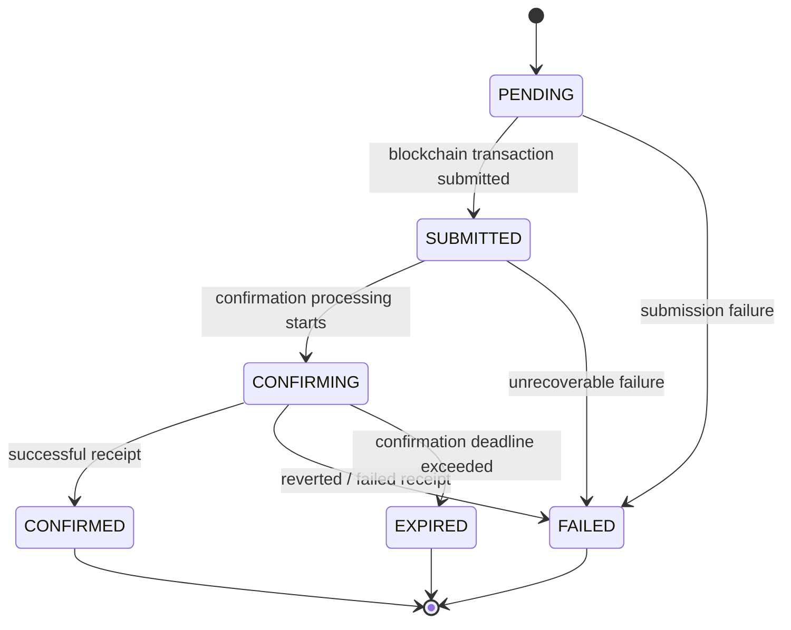
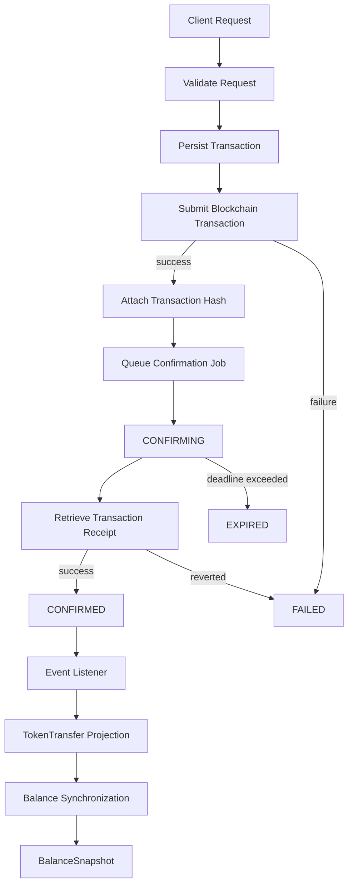
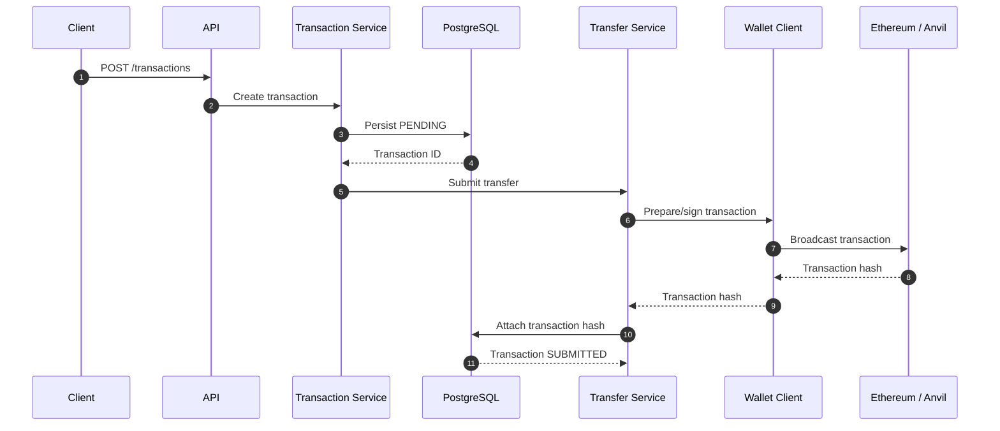
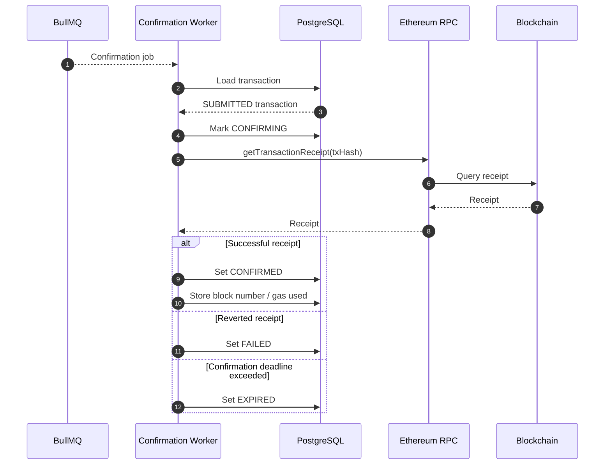
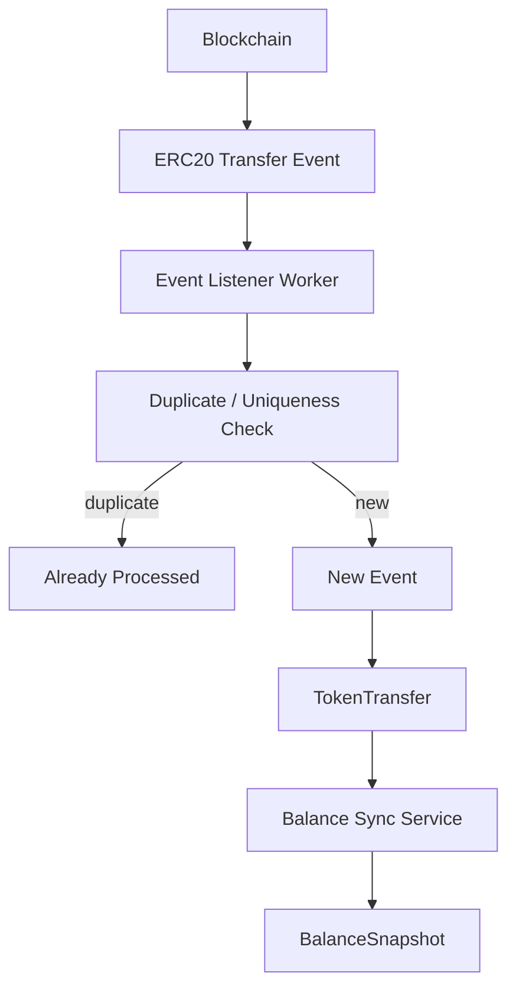
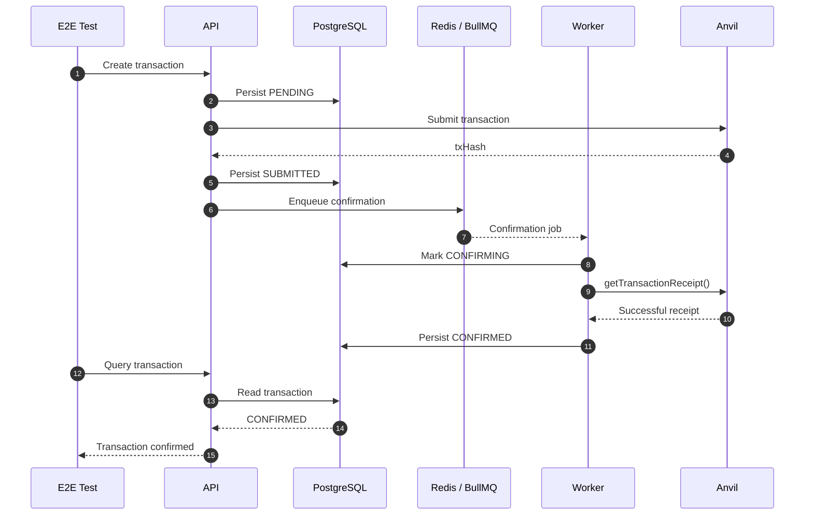

# Transaction Lifecycle

## Overview

The Blockchain Transaction Simulator implements an asynchronous blockchain transaction lifecycle similar to production payment and asset-transfer platforms.

A transaction moves through multiple stages:

1. Request validation
2. Database persistence
3. Blockchain submission
4. Transaction hash attachment
5. Confirmation processing
6. Blockchain receipt evaluation
7. Event indexing
8. Balance synchronization

The lifecycle is designed around:

* Explicit transaction states
* Asynchronous blockchain confirmation
* Retryable background processing
* Confirmation deadlines
* Failure handling
* Idempotent processing
* Auditability
* Observable state transitions

---

# Transaction State Machine

The application transaction lifecycle is:



The normal successful lifecycle is:

```text
PENDING
   |
   v
SUBMITTED
   |
   v
CONFIRMING
   |
   v
CONFIRMED
```

Terminal states are:

```text
CONFIRMED
FAILED
EXPIRED
```

---

# State Definitions

## PENDING

The transaction has been accepted by the application and persisted in PostgreSQL but has not yet been successfully submitted to the blockchain.

Typical characteristics:

```text
status = PENDING
```

At this point the application has an internal transaction ID.

---

## SUBMITTED

The blockchain transaction has been successfully submitted and a blockchain transaction hash has been attached to the application transaction.

Conceptually:

```text
Application Transaction
        |
        +-- transactionId
        |
        +-- txHash
        |
        v
Blockchain Transaction
```

The blockchain transaction has not necessarily been confirmed yet.

---

## CONFIRMING

The Confirmation Worker has begun processing the submitted transaction.

The worker retrieves the blockchain receipt and evaluates its result.

```text
SUBMITTED
    |
    v
Confirmation Worker
    |
    v
CONFIRMING
```

This state represents the asynchronous confirmation phase.

---

## CONFIRMED

The blockchain receipt indicates successful execution.

The application records confirmation metadata including:

* Block number
* Gas used
* Confirmation timestamp

```text
CONFIRMING
     |
     v
CONFIRMED
```

This is a terminal transaction state.

---

## FAILED

The transaction could not complete successfully.

Possible causes include:

* Blockchain submission failure
* Contract execution failure
* Reverted transaction receipt
* Unrecoverable RPC failure
* Invalid nonce
* Insufficient funds
* Other unrecoverable blockchain errors

```text
FAILED
```

This is a terminal transaction state.

---

## EXPIRED

The transaction did not reach a terminal confirmation state before its configured confirmation deadline.

```text
CONFIRMING
     |
     | deadline exceeded
     v
EXPIRED
```

Expiration prevents transactions from remaining indefinitely in an intermediate state.

---

# Lifecycle Overview



Event indexing and balance synchronization occur **after blockchain activity**, but they are separate asynchronous processing concerns from transaction confirmation.

---

# Transaction Creation Flow

## Step 1: API Request

The client submits a transaction request.

Example:

```http
POST /api/v1/transactions
```

The request identifies the information required to construct the blockchain transaction.

Typical data includes:

* Source wallet
* Destination wallet
* Token
* Amount
* Transaction metadata

Authentication and authorization are applied before the request reaches the transaction service.

---

# Step 2: Request Validation

The API layer validates the incoming request.

Validation includes:

* Wallet addresses
* Token identifiers
* Transfer amount
* Required fields
* Authentication context

Validation is performed using Zod schemas.

Invalid requests are rejected before blockchain interaction occurs.

```text
HTTP Request
     |
     v
Authentication
     |
     v
Validation
     |
     +------ invalid ------> API Error
     |
     v
Transaction Service
```

---

# Step 3: Transaction Persistence

A transaction record is created before blockchain submission.

Initial state:

```text
PENDING
```

Conceptually:

```json
{
  "id": "tx-123",
  "status": "PENDING",
  "amount": "100",
  "tokenId": "token-1"
}
```

Persisting the transaction first provides:

* Auditability
* Internal transaction identity
* Failure visibility
* Recovery context
* Correlation between application and blockchain activity

---

# Blockchain Submission

After the transaction has been persisted, the application submits the blockchain transaction.



The blockchain submission is deliberately separated from confirmation.

A returned transaction hash does not mean that the transaction has successfully executed.

---

# Transaction Hash Attachment

After successful submission, the blockchain returns a transaction hash.

```text
Blockchain
     |
     v
Transaction Hash
     |
     v
Ledger / Transaction Record
```

The hash provides the bridge between the application transaction and the blockchain transaction.

Conceptually:

```json
{
  "id": "tx-123",
  "status": "SUBMITTED",
  "txHash": "0xabc123"
}
```

The application can subsequently use the hash to query the blockchain receipt.

---

# Confirmation Processing

Blockchain confirmation is asynchronous.

The API does not wait indefinitely for blockchain confirmation.

Instead, the application places confirmation work onto the background processing system.

```text
Transaction
     |
     v
BullMQ
     |
     v
Confirmation Worker
     |
     v
Blockchain RPC
```

The Confirmation Worker is responsible for progressing submitted transactions toward a terminal state.

---

# Confirmation Worker

Location:

```text
src/workers
```

The worker periodically processes submitted transactions.

Its responsibilities include:

* Loading transactions requiring confirmation
* Retrieving blockchain receipts
* Evaluating receipt status
* Recording block number
* Recording gas usage
* Recording confirmation timestamps
* Enforcing confirmation deadlines
* Handling retryable failures

---

# Confirmation Process



---

# Successful Confirmation

When the blockchain receipt indicates successful execution, the application records confirmation information.

Typical data includes:

```json
{
  "status": "CONFIRMED",
  "blockNumber": 100,
  "gasUsed": "50000",
  "confirmedAt": "2026-07-29T10:00:00Z"
}
```

The exact persistence representation is defined by the Prisma transaction model.

The important architectural rule is that confirmation is based on blockchain receipt information rather than simply the existence of a transaction hash.

---

# Failed Transaction Handling

A transaction can fail at multiple points.

Examples include:

* Transaction submission failure
* Contract execution failure
* Reverted receipt
* Invalid nonce
* Insufficient funds
* Unrecoverable RPC error

The application records the transaction as:

```text
FAILED
```

Failed transactions remain visible for:

* Investigation
* Reporting
* Operational diagnostics
* Future recovery workflows

A failed transaction must not be treated as successfully confirmed.

---

# Confirmation Timeout and Expiration

Blockchain confirmation may take longer than expected.

The application therefore supports a confirmation deadline.

Relevant lifecycle information includes:

```text
confirmationStartedAt
confirmationDeadline
```

The timeout flow is:

```text
SUBMITTED
    |
    v
CONFIRMING
    |
    +---- receipt found ----> CONFIRMED
    |
    +---- failed receipt --> FAILED
    |
    +---- deadline exceeded -> EXPIRED
```

Expiration prevents a transaction from remaining indefinitely in an intermediate confirmation state.

---

# Retry and Backoff

Confirmation processing is asynchronous and retryable.

BullMQ provides job retry behavior with configured attempts and exponential backoff.

Conceptually:

```text
Confirmation Job
       |
       v
   Attempt 1
       |
       +---- success ----> Terminal State
       |
       +---- temporary failure
                    |
                    v
               Backoff
                    |
                    v
                Attempt 2
                    |
                   ...
```

Retryable infrastructure failures should not immediately be interpreted as blockchain transaction failures.

For example, an RPC timeout while querying a receipt does not necessarily mean that the blockchain transaction failed.

---

# Idempotent Confirmation

Confirmation jobs may execute more than once because of:

* Queue retries
* Worker restarts
* Temporary failures
* Duplicate job execution

Confirmation processing therefore needs to be idempotent.

Terminal states must not be accidentally transitioned into another unrelated terminal state.

Conceptually:

```text
CONFIRMED
   |
   +--> repeated confirmation attempt
           |
           v
       No-op / Already Final

FAILED
   |
   +--> repeated confirmation attempt
           |
           v
       No-op / Already Final

EXPIRED
   |
   +--> repeated confirmation attempt
           |
           v
       No-op / Already Final
```

This prevents duplicate lifecycle transitions.

---

# Event Indexing

Successful blockchain transactions may produce events.

For ERC20 transfers:

```text
Blockchain Transaction
       |
       v
ERC20 Transfer Event
       |
       v
Event Listener Worker
       |
       v
TokenTransfer
```

Transaction confirmation and event processing are related but separate concerns.

A transaction can be confirmed before the corresponding event has been persisted into the application database.

---

# Event Processing Flow



---

# Event Idempotency

Blockchain event processing must be safe to retry.

Events are identified using blockchain-specific coordinates such as:

```text
transactionHash + logIndex
```

This provides a stable event identity.

Conceptually:

```text
Blockchain Event
      |
      +-- Transaction Hash
      |
      +-- Log Index
      |
      v
Unique Event Identity
      |
      v
TokenTransfer Record
```

If an event is processed again, the listener should detect that the event has already been persisted and avoid creating a duplicate logical record.

---

# Balance Synchronization

After token transfer events are processed, affected balances can be synchronized.

The synchronization flow is:

```text
TokenTransfer
      |
      v
Affected Wallet
      |
      v
Balance Sync Service
      |
      v
ERC20 balanceOf()
      |
      v
On-Chain Balance
      |
      v
BalanceSnapshot
```

The blockchain remains authoritative for the current token balance.

PostgreSQL stores a durable application projection for efficient querying and historical tracking.

---

# Lifecycle and Eventual Consistency

Transaction confirmation, event processing, and balance synchronization are separate asynchronous stages.

Therefore, temporary differences between blockchain state and PostgreSQL projections are expected.

For example:

```text
Blockchain:
Transaction = CONFIRMED

PostgreSQL:
Transaction = CONFIRMED
TokenTransfer = not yet indexed
BalanceSnapshot = not yet synchronized
```

The system eventually converges as background processing completes.

---

# Error Handling Strategy

Failures are handled according to the lifecycle stage.

## API Failure

Examples:

* Invalid request
* Authentication failure
* Authorization failure
* Validation failure

Result:

```text
Request rejected
```

No blockchain transaction is created.

---

## Database Persistence Failure

If the application cannot create the initial transaction record, blockchain submission should not proceed.

This protects the system from creating an on-chain transaction without an application-level transaction record.

---

## Blockchain Submission Failure

Examples:

* RPC rejection
* Invalid nonce
* Insufficient funds
* Contract failure
* Invalid transaction parameters

Result:

```text
Submission Failure
       |
       v
Transaction Failure Handling
       |
       v
FAILED
```

The failure should be logged with sufficient context for diagnosis.

---

## Confirmation RPC Failure

A temporary receipt lookup failure does not necessarily indicate blockchain transaction failure.

Example:

```text
getTransactionReceipt()
        |
        v
RPC Timeout
        |
        v
Retry / Backoff
        |
        v
Try Again
```

This distinction is important because infrastructure failure and blockchain execution failure are different failure classes.

---

## Confirmation Deadline

If the transaction remains unconfirmed beyond its configured deadline:

```text
CONFIRMING
     |
     v
Deadline Exceeded
     |
     v
EXPIRED
```

---

## Event Processing Failure

Examples:

* RPC unavailable
* PostgreSQL unavailable
* Worker restart
* Temporary processing error

Result:

```text
Event
  |
  v
Processing Failure
  |
  v
Retry
  |
  v
Process Again
```

Idempotency prevents retries from producing duplicate records.

---

# Transaction Lifecycle Observability

Every important lifecycle transition should be observable.

## Structured Logs

Representative lifecycle events include:

```text
transaction.created

transaction.submitted

transaction.confirmation.started

transaction.confirmed

transaction.failed

transaction.expired
```

Logs should include useful correlation information such as:

```text
transactionId
transactionHash
walletAddress
chainId
```

Sensitive credentials must never be logged.

---

# Metrics

Representative transaction metrics include:

```text
transactions_created_total

transactions_submitted_total

transactions_confirmed_total

transactions_failed_total

transactions_expired_total

transaction_confirmation_duration_seconds
```

Blockchain metrics include:

```text
blockchain_rpc_requests_total

blockchain_rpc_failures_total

blockchain_rpc_duration_seconds
```

Worker metrics should provide visibility into:

```text
confirmation jobs
job failures
job retries
processing latency
```

---

# Lifecycle Auditability

A transaction should provide enough persisted information to reconstruct its lifecycle.

Conceptually:

```text
Transaction
 |
 +-- id
 |
 +-- status
 |
 +-- txHash
 |
 +-- confirmationStartedAt
 |
 +-- confirmationDeadline
 |
 +-- blockNumber
 |
 +-- gasUsed
 |
 +-- confirmedAt
 |
 +-- createdAt
 |
 +-- updatedAt
```

The exact field names and optionality are defined by the Prisma schema.

The purpose is to retain a durable record of the transaction's progression through the system.

---

# Why Persist Before Blockchain Submission?

The transaction is persisted before submission so that the application has an internal record before interacting with an external system.

Benefits include:

* Audit trail
* Internal transaction identity
* Request tracking
* Failure visibility
* Operational diagnostics
* Recovery context

The architectural sequence is therefore:

```text
Validate
   |
   v
Persist
   |
   v
Submit
```

rather than:

```text
Validate
   |
   v
Submit
   |
   v
Persist
```

The latter creates a risk of an on-chain transaction existing without an application record if persistence fails afterward.

---

# Why Use a Background Worker?

Blockchain confirmation time is unpredictable.

A synchronous API request should not remain blocked while waiting for a blockchain receipt.

The worker architecture provides:

* Non-blocking APIs
* Retry capability
* Exponential backoff
* Worker concurrency
* Failure isolation
* Confirmation deadlines
* Horizontal scaling potential

Architecture:

```text
HTTP Request
     |
     v
Submit Transaction
     |
     v
Return Application Response
     |
     v
BullMQ
     |
     v
Confirmation Worker
     |
     v
Blockchain Receipt
```

---

# Why Use Blockchain Events?

Transaction receipts tell the application whether a transaction executed successfully.

Events provide additional information about what happened on-chain.

For an ERC20 transfer:

```text
Transaction Receipt
       |
       +-- execution result
       |
       +-- block number
       |
       +-- gas used
       |
       +-- emitted events
                    |
                    v
              Transfer Event
```

Event-driven synchronization therefore provides:

* Durable projections
* Replay capability
* Auditability
* Idempotent processing
* Eventual consistency

---

# State Transition Ownership

State transitions should have clear ownership.

| Transition                           | Primary Owner                         |
| ------------------------------------ | ------------------------------------- |
| Request → PENDING                    | Transaction Service                   |
| PENDING → SUBMITTED                  | Transaction / Transfer / Ledger flow  |
| SUBMITTED → CONFIRMING               | Confirmation Worker                   |
| CONFIRMING → CONFIRMED               | Confirmation Worker                   |
| CONFIRMING → FAILED                  | Confirmation Worker / submission flow |
| CONFIRMING → EXPIRED                 | Confirmation Worker                   |
| CONFIRMED → TokenTransfer projection | Event Listener                        |
| TokenTransfer → BalanceSnapshot      | Balance Sync Service                  |

This separation prevents unrelated components from modifying transaction state arbitrarily.

---

# Transaction Lifecycle Invariants

The following invariants should hold.

## No Blockchain Transaction Without Application Context

A blockchain submission should be associated with an application transaction.

---

## Transaction Hash Is Not Confirmation

```text
txHash != confirmed
```

A transaction hash only proves that a blockchain transaction was submitted/identified.

Confirmation requires receipt evaluation.

---

## Terminal States Are Final

Once a transaction reaches:

```text
CONFIRMED
FAILED
EXPIRED
```

normal confirmation processing should not move it back into an intermediate state.

---

## Event Processing Is Independent

A confirmed transaction does not imply that its event projection has already been processed.

```text
CONFIRMED
    |
    +--> Event Processing
            |
            +--> TokenTransfer
                    |
                    +--> BalanceSnapshot
```

---

# Testing the Lifecycle

The transaction lifecycle should be tested at multiple levels.

## Unit Tests

Test:

* State transitions
* Service behavior
* Error handling
* Repository behavior
* Confirmation worker logic

---

## Integration Tests

Test:

* PostgreSQL persistence
* Redis/BullMQ processing
* Blockchain RPC interaction
* Transaction confirmation
* Event processing
* Balance synchronization

---

## E2E Tests

The E2E environment verifies the complete flow:



The E2E test validates the interaction between application persistence, queue processing, blockchain submission, and confirmation.

---

# Future Improvements

Potential extensions include:

* Configurable confirmation depth
* More sophisticated transaction retry policies
* Dead-letter queues for failed background jobs
* Distributed worker execution
* Blockchain reorganization handling
* Multi-chain transaction support
* Transaction replacement handling
* Automated reconciliation jobs
* Confirmation monitoring improvements

These should extend the existing lifecycle without weakening its explicit state model and idempotency guarantees.

---

# Relationship to Other Architecture Documents

This document focuses specifically on the application transaction lifecycle.

Related documentation:

```text
docs/architecture.md
    |
    +-- Overall system architecture

docs/blockchain-integration.md
    |
    +-- Blockchain clients, RPC, contracts,
        events and blockchain state

docs/transaction-lifecycle.md
    |
    +-- Application transaction state machine,
        confirmation, expiration and failure

docs/observability.md
    |
    +-- Logging, metrics and tracing

docs/testing.md
    |
    +-- Unit, integration and E2E verification
```

The overall architecture document describes **where the transaction lifecycle fits**.

The blockchain integration document describes **how blockchain interaction works**.

This document describes **how an application transaction progresses from creation to a terminal state and how subsequent blockchain-derived projections are produced**.
